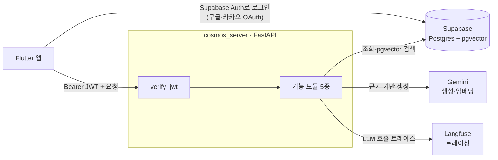
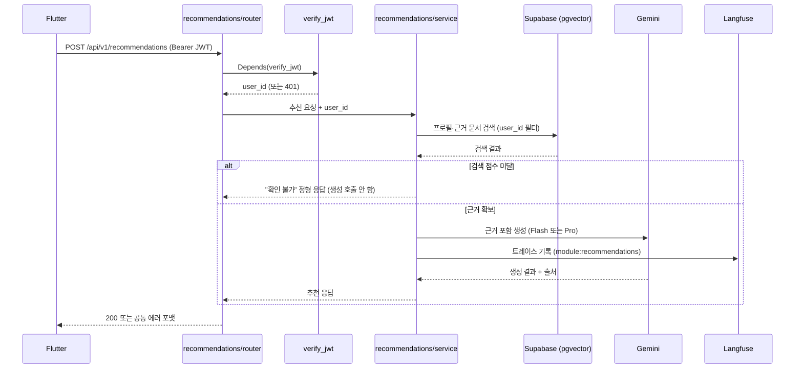

# 서버 아키텍처

- **작성일**: 2026-07-09
- **작성자**: 김민경

- **대상**: cosmos_server에 코드를 쓰는 백엔드 팀원 (박영기·이호영·박금별·김민경)
- **범위**: 이 저장소(FastAPI 서버)의 내부 구조. 상위 시스템 설계(클라이언트·인프라 포함)는 [시스템 아키텍처 설계서](https://app.notion.com/p/396d3e5629a4815d90a2c94743de8bb1)(Notion)가 진실 공급원이다.

## 1. 개요

cosmos_server는 화장품 전성분 해설·2개 제품 교차 조회·BSTI 기반 성분 추천을 제공하는 백엔드 API다.
Flutter 앱이 유일한 클라이언트이며, 서버는 요청 인증·데이터 조회·LLM 생성을 담당한다.

이 저장소가 책임지는 것과 책임지지 않는 것을 먼저 분명히 한다.

| 서버가 하는 일 | 서버가 하지 않는 일 |
|---|---|
| JWT 검증, 요청 라우팅, 비즈니스 로직 | 사용자 로그인 자체 (Supabase Auth가 담당) |
| Supabase 조회·pgvector 검색 | DB 스키마 소유 (`supabase/` 마이그레이션이 소유) |
| Gemini 호출과 근거 기반 생성 | 프롬프트 UI·화면 (Flutter가 담당) |
| Langfuse 트레이싱 | 임베딩 원본 데이터 구축 (데이터 파이프라인이 담당) |

## 2. 시스템 컨텍스트



핵심은 **인증의 두 경로**다. 사용자는 Flutter에서 Supabase Auth로 직접 로그인해 JWT를 받고,
그 JWT를 서버에 `Authorization: Bearer`로 전달한다. 서버는 로그인을 처리하지 않고 검증만 한다.

## 3. 레이어 구조

의존은 항상 위에서 아래로만 흐른다. 아래 계층은 위 계층을 알지 못한다.

```
app/main.py                  앱 조립 — 라우터 등록, 전역 예외 핸들러, 헬스체크
  │
  ├─ app/modules/<모듈>/      기능. router.py → service.py → schemas.py (단방향)
  │                          모듈끼리는 서로 import 하지 않는다 (import-linter 강제)
  │
  ├─ app/core/               공통 인프라. config·auth·supabase·gemini·langfuse
  │
  └─ app/common/             교차 스키마 (에러 응답 등)
```

- `router.py`는 HTTP 관심사(경로·상태 코드·의존성)만 다루고 로직은 `service.py`에 둔다.
- 모듈이 다른 모듈의 코드를 필요로 하면, 그 코드를 `core/` 또는 `common/`으로 올린 뒤 양쪽이 참조한다.
  이 규칙은 문서가 아니라 도구로 강제된다 — `uv run lint-imports`가 위반을 잡는다
  ([pyproject.toml](../pyproject.toml)의 `independence` contract).

## 4. 모듈 구성

각 모듈은 담당자 1명의 작업 영역이며 폴더 하나에 대응한다. 이렇게 나눈 것은 5명이 병렬로
작업할 때 PR 충돌을 최소화하기 위해서다.

| 모듈 | 기능 | URL prefix | 담당 |
|---|---|---|---|
| `ingredient_search` | 제품명·성분명 검색 (tsvector 우선, pgvector 폴백) | `/api/v1/ingredients` | 박영기 |
| `ingredient_detail` | 개별 성분 해설·주의사항 | `/api/v1/ingredients` | 이호영 |
| `product_compare` | 멀티 제품 교차 조회 | `/api/v1/products` | 박영기 |
| `bsti` | BSTI 16타입 검사 | `/api/v1/bsti` | 박금별 |
| `recommendations` | 성분 추천 Agent | `/api/v1/recommendations` | 김민경 |

현재 각 모듈의 라우터는 501(미구현) 스텁 1개만 두어 등록 배선을 검증한 상태다.
실제 엔드포인트는 API 명세서 확정 후 담당자가 채운다.

## 5. 공통 인프라 (`app/core`)

| 구성 요소 | 역할 | 핵심 설계 |
|---|---|---|
| `config.py` | `.env`·환경 변수 로딩 | `BaseSettings`. 필수값(Supabase·Gemini·Langfuse 키) 누락 시 **기동 시점에 즉시 실패**한다. 모델명·로그 레벨도 설정으로 주입 |
| `auth.py` | JWT 검증 의존성 | `verify_jwt` — HS256 + Supabase JWT secret으로 검증, `audience=authenticated` 확인, `sub`(user_id) 반환. 실패는 모두 401 |
| `supabase.py` | Supabase 클라이언트 | `AsyncClient` 지연 싱글턴. **비동기**다 — async 라우터에서 이벤트 루프를 막지 않기 위해 동기 클라이언트를 쓰지 않는다 |
| `gemini.py` | Gemini 클라이언트 | 클라이언트 래퍼 + `gemini_model_for()` — Flash 기본, 복합 질의만 Pro |
| `langfuse.py` | 트레이싱 클라이언트 | Langfuse 초기화. 실제 트레이스는 각 모듈 LLM 호출 시 부착 |

설정·클라이언트를 `core`에 모은 이유는, 팀원이 각자 인증·클라이언트를 중복 구현하는 것을 막기 위해서다.
외부 서비스 접근은 반드시 `get_supabase()`·`get_gemini()`·`get_langfuse()`를 거친다.

## 6. 인증과 데이터 접근

### 6.1 JWT 검증 흐름

보호 라우터는 `user_id: str = Depends(verify_jwt)` 한 줄로 인증을 적용한다. 인증 없이 여는
엔드포인트는 `/health`·`/health/ready`뿐이며, 추가하려면 팀 합의가 필요하다.

`verify_jwt`는 토큰 부재·서명 오류·만료·`sub` 누락을 모두 401로 처리한다. 특히 서명이
유효해도 `sub`가 없으면 사용자를 특정할 수 없으므로, 500이 아니라 `AUTH_INVALID_TOKEN` 401을 반환한다.

### 6.2 RLS 우회 — 서비스 코드가 권한을 책임진다

서버는 Supabase에 **service role 키**로 접근한다. 이 키는 RLS(Row Level Security)를 우회하므로,
DB 정책이 아니라 **서비스 코드가 직접 행 수준 권한을 검사해야 한다.**

- 사용자 소유 데이터를 다루는 모든 쿼리는 `verify_jwt`가 반환한 `user_id`로 반드시 필터링한다
  (예: `.eq("user_id", user_id)`). 조회·목록·수정·삭제 어느 경로든 예외 없다.
- 이 필터를 빠뜨리면 타 사용자 데이터가 그대로 노출된다. PR 리뷰의 우선 확인 항목이다.

상세는 [conventions.md](conventions.md)의 "데이터 접근 보안 (RLS 우회 주의)" 절을 따른다.

## 7. LLM·RAG 파이프라인

LLM을 호출하는 모듈(`ingredient_detail`·`product_compare`·`recommendations`)은 아래 원칙을
예외 없이 지킨다. 상세는 [llm-rag-rules.md](llm-rag-rules.md).

- **근거 기반 생성 강제**: retrieval 없이 LLM 단독 생성을 하지 않는다. 검색 점수가 임계값
  미달이면 생성을 호출하지 않고 "확인 불가" 정형 응답을 반환한다 — 불필요한 과금도 함께 막는다.
- **Prompt Injection 방어**: 사용자 입력은 지시문과 분리된 데이터 블록(`<user_input>`)으로 격리한다.
- **모델 선택**: 기본 Flash, 여러 근거를 종합하는 생성(교차 주의 문구·추천 최종 합성)만 Pro.
  모델명은 하드코딩하지 않고 `gemini_model_for()`를 거친다.
- **트레이싱 필수**: 모든 LLM 호출은 Langfuse 트레이스를 남기고 모듈 태그(`module:*`)를 붙인다.
  비용·품질을 모듈별로 추적하기 위해서다.

## 8. 요청 처리 흐름 (추천 예시)



## 9. 에러 처리와 헬스체크

### 9.1 공통 에러 포맷

모든 에러 응답은 전역 예외 핸들러가 아래 형태로 보장한다.

```json
{"error": {"code": "AUTH_INVALID_TOKEN", "message": "유효하지 않은 토큰입니다."}}
```

`main.py`에 세 핸들러를 등록했다 — HTTP 예외(우리 코드 dict / 그 외), 유효성 오류(422),
처리되지 않은 예외(500, 스택 로깅). 에러 코드 체계는 [conventions.md](conventions.md)의 "API 설계" 절.

### 9.2 헬스체크 — liveness와 readiness 분리

| 엔드포인트 | 용도 | 동작 |
|---|---|---|
| `GET /health` | Liveness | 프로세스 생존만 확인. 인증 없이 `{"status":"ok"}` 200 |
| `GET /health/ready` | Readiness | Supabase 도달 가능성까지 확인. 실패 시 `NOT_READY` 503 |

liveness와 readiness를 나눈 이유는, "프로세스는 떠 있지만 의존 서비스가 죽은" 상태를 배포
게이트에서 구분하기 위해서다. 호스팅(Railway/Cloud Run)의 헬스체크 경로 선택은 배포 확정 후 정한다.

## 10. 품질 게이트

머지 전 아래 네 도구가 모두 통과해야 한다. 로컬과 CI(추후) 공통 기준이다.

| 도구 | 검증 대상 | 명령 |
|---|---|---|
| pytest | 동작 (헬스·라우터 등록·인증·설정) | `uv run pytest` |
| mypy | 타입 정합성 (우리 코드 strict, 서드파티 관대) | `uv run mypy` |
| ruff | 린트 + 포맷 | `uv run ruff check . && uv run ruff format --check .` |
| import-linter | 모듈 독립성 | `uv run lint-imports` |

---

**구성 근거**: 상위 시스템 설계서(Notion)와 초기 세팅 설계서가 이미 있으므로, 이 문서는 그 둘이
다루지 않는 "코드가 실제로 어떻게 조립됐는가"에 집중했다. 레이어·모듈·인증·RAG를 실제 파일과
1:1로 대응시켜, 팀원이 문서를 읽고 바로 코드 위치를 찾을 수 있게 했다. 다이어그램은 텍스트로
설명하기 어려운 인증 두 경로와 추천 흐름의 분기(검색 점수 미달 시 생성 생략)에만 넣었다.
