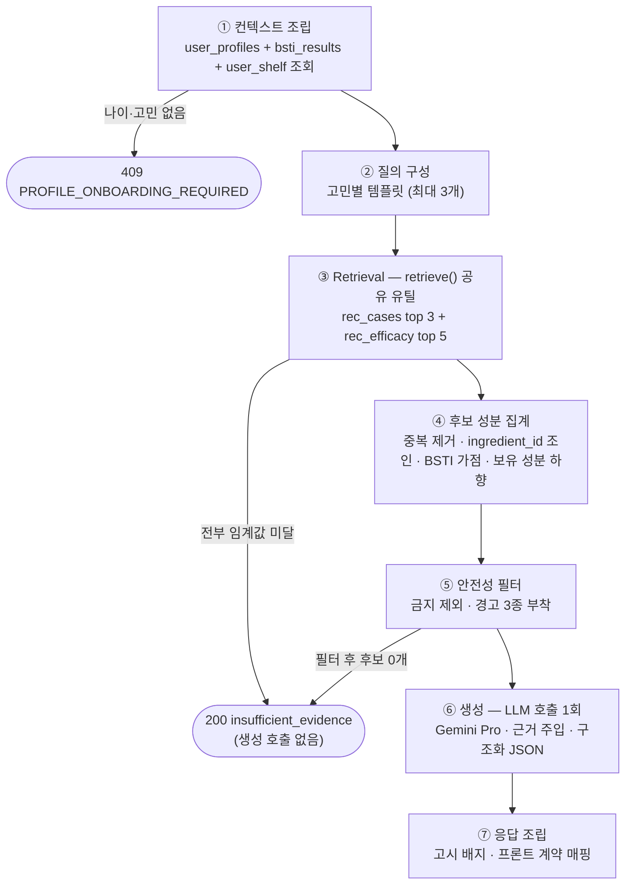

# 성분 추천(recommendations) 파이프라인 설계서

- **작성일**: 2026-07-10
- **작성자**: 김민경
- **대상 모듈**: `app/modules/recommendations` (담당: 김민경) · 엔드포인트: `POST /api/v1/recommendations`
- **네이밍**: API 경로(`/recommendations`)에 맞춰 모듈·문서·태그를 recommendations(복수)로 통일 (패키지 개칭 완료)

사용자의 온보딩 프로필(나이·성별·피부 고민)·BSTI 검사 결과·**화장대에 등록한 보유
제품의 성분**을 입력으로, AI Hub 스킨케어 성분-효능 데이터(dataSetSn=71886) 기반
RAG로 개인 맞춤 성분을 추천한다. cosmos의 흐름(제품 검색 → 전성분 해설 → 교차 분석
→ 추천)에서 추천은 **분석 보고서의 결론부**다 — 사용자의 현재 루틴을 알아야 "부족한
성분"을 말할 수 있다. 데이터 테이블·적재·임베딩 명세는
[02-recommendations-data-spec.md](02-recommendations-data-spec.md) 참조.

## 0. 한눈에 보기

- **이 기능이 하는 일**: 사용자 정보(나이·성별·피부 고민)·BSTI 피부타입·보유 제품
  성분을 받아 "당신에게는 이런 성분이 좋아요(특히 지금 루틴에 없는 것)"를
  이유·주의사항·근거와 함께 돌려준다.
- **왜 RAG인가**: LLM에게 곧바로 추천을 시키면 그럴듯한 거짓(환각)을 만든다. 그래서
  먼저 신뢰할 수 있는 자료를 **검색(Retrieval)** 하고, 그 자료만 근거로 LLM이 답을
  **생성(Generation)** 하게 한다 — 이것이 RAG(검색 증강 생성)다.
- **재료 두 가지 (이중 인덱스)**: 상담 사례 8,000건(`rec_cases` — "나와 비슷한 사람은
  어떤 답을 받았나")과 성분 지식 2,465종(`rec_efficacy` — "이 고민에 효과 있는 성분은
  뭔가"). 역할이 달라 인덱스를 둘로 나눴다.
- **구조**: 고정 시퀀스 7단계. LLM 호출은 마지막 딱 1회뿐이라 비용·지연이 예측 가능하다.
- **핵심 원칙**: 근거 없으면 생성하지 않는다(환각·비용 차단) · 위험 성분은 거른다 ·
  정확해야 하는 값(성분 ID·경고·출처)은 LLM이 아니라 코드가 붙인다.

## 1. 확정 결정 요약

| 항목 | 결정 |
|---|---|
| 파이프라인 구조 | 고정 시퀀스 7단계 (LLM 생성은 마지막 1회) — function calling 에이전트·LangGraph 미도입 |
| 검색 인덱스 | 이중 인덱스: 상담 케이스(`rec_cases`) + 성분지식(`rec_efficacy`) |
| 입력 소스 | 프로필·BSTI 결과·**화장대(user_shelf) 보유 성분**을 서버가 DB에서 직접 조회. 요청 바디 없음 (박금별 프론트 명세 정렬) |
| 온보딩 | 필수 — 프로필에 나이·피부 고민 없으면 `409 PROFILE_ONBOARDING_REQUIRED` |
| BSTI 활용 | 축 서술은 추천 모듈 소유(`bsti_axes.py`), **타입별 권장·기피 성분은 `bsti_results`(박금별 매핑)를 소비** — 매핑 이중화 방지 |
| 피부 고민 | 8종 enum 고정 (AI Hub 라벨과 1:1), 요청당 최대 3개 사용 |
| 출력 스코프 | v1 성분 추천만. `recommended_products`는 필드 유지 + 빈 배열 (MVP 후 확장) |
| 화장대(user_shelf) | **v1 포함으로 변경 (2026-07-10)** — 보유 중 표시 + 결핍 보완(보유 성분 순위 하향·새 성분 우선). 성분 간 궁합·충돌 분석은 근거 데이터가 없어 v1.1+ (§7). 화장대가 비어 있으면 보정 없이 진행 |
| 안전성 정책 | 식약처 `금지`=후보 제외, `한도`=경고 + 미매핑 성분 명칭 보조 검사 + 알레르기 25종·BSTI 기피 경고. `restrictions` 적재 완료가 출시 조건 |
| 임베딩·인덱싱 | **서지우 담당** — 요청 명세는 02 문서 §4 |

## 2. 파이프라인 흐름



모든 단계는 Langfuse 트레이스(`module:recommendations` 태그)를 남긴다.

### ① 컨텍스트 조립 — "이 사람이 누구인지 파악한다"

로그인한 사용자의 프로필과 최근 BSTI 결과를 DB에서 읽어 추천의 입력을 만든다.

- `user_profiles`에서 `age`·`gender`·`skin_concerns[]`, `bsti_results` 최근 행에서
  `type_code`·`recommended_ingredients`·`caution_ingredients`를 조회한다.
- 나이 또는 피부 고민이 없으면(온보딩 미완료) `409 PROFILE_ONBOARDING_REQUIRED`.
  BSTI 결과가 없으면 BSTI 요소만 생략하고 진행한다.
- **BSTI 축 해석**: 타입 코드 4글자가 곧 4축이다 — 유·수분(O 지성/D 건성),
  민감도(S 민감/R 저항), 색소(P/N), 노화(W 주름/T 탱탱). 즉 `OSPW`를 "지성·민감·색소·주름
  경향 피부"라는 검색용 설명 문장으로 푼다. `bsti_axes.py`는 16타입 dict가 아니라
  **축별 특성 서술 사전 8개 엔트리**로 구성하고, 코드를 분해해 조합한다 (박금별 "BSTI
  근거 및 성분정보" 페이지의 축 정의를 따름). 타입별 추천 성분 목록은 여기 두지 않고
  박금별의 `bsti_results`를 그대로 소비한다 — 같은 정보를 두 곳에서 관리하면 어긋난다.
- **보유 성분 집합**: `user_shelf`에서 사용자의 화장대 항목을 읽어 보유 성분 집합을
  만든다 — 제품 등록(`item_type=product`)은 `product_ingredients` 조인으로 성분을
  풀고, 성분 직접 등록(`item_type=ingredient`)은 그대로 담는다. **화장대가 비어
  있거나 테이블 미구현이면 빈 집합으로 진행** (BSTI 없음과 동일한 우아한 축소).
  쿼리는 `.eq("user_id", user_id)` 필수.
- 산출: `UserContext { age, gender, bsti_type?, bsti_recommended[], bsti_caution[], owned_ingredients[], concerns[] (≤3) }`
- 고민이 3개를 초과하면 앞 3개만 사용(`MAX_CONCERNS = 3`) — 검색 호출 상한을
  3고민 × 2컬렉션 = 6회로 고정해 비용을 보호한다.

### ② 질의 구성 — "무엇을 검색할지 검색어를 만든다"

고민별 검색 질의를 템플릿으로 생성한다. age·gender·축 특성 서술을 조합하고 없는
요소는 생략한다. 예: *"30대 여성, 지성·민감 경향 피부의 모공 관리에 도움되는 성분"*.

### ③ Retrieval — "믿을 수 있는 자료를 찾아온다" (공유 `retrieve()` 유틸)

만든 질의로 두 인덱스를 각각 검색한다. 단어 일치가 아니라 **의미가 비슷한 것**을 찾는
벡터 검색이라 "모공 넓어짐"과 "모공이 커 보임"을 같은 뜻으로 매칭한다.

| 컬렉션 | top_k | 필터 | 목적 |
|---|---|---|---|
| `rec_cases` | 3 | 고민 라벨 (`skin_concerns` 배열 겹침 매칭) | 나이·피부타입이 유사한 상담 사례 |
| `rec_efficacy` | 5 | 없음 | 성분-효능 근거 |

- 계약: score(자료가 질의에 얼마나 맞는지 0~1 점수) 정규화, 빈 결과는 빈 리스트
  (`app/common/retrieval.py`).
- score < `MIN_RETRIEVAL_SCORE`(모듈 상수, **초기값 0.5**) 컷은 **호출자인 이 모듈이**
  수행한다. 초기값은 가설이며 Langfuse 트레이스의 실제 score 분포로 튜닝한다.
- **성능**: 고민별 질의 텍스트는 두 컬렉션에 동일하므로 질의 임베딩은 최대 3회면
  된다(6회 아님 — 임베딩 전달 옵션 또는 유틸 내부 캐시를 서지우와 협의, 02 §4).
  검색 6회는 `asyncio.gather`로 병렬 실행한다 — 순차 실행 시 검색 1~2.5초 +
  생성 4~10초로 총 5~12초가 예상되므로, 병렬화로 지연을 생성 1회 수준에 수렴시킨다.
- **희소 고민 보완** (케이스 분포 불균형 — 민감성 6건·처짐 47건, 02 문서 §1):
  배열 겹침 매칭 → 부족 시 무필터 검색 1회 fallback → 그래도 빈약하면 효능
  인덱스 근거에 자연 의존 (이중 인덱스의 존재 이유).

### ④ 후보 성분 집계 — "찾아온 자료에서 성분 목록을 뽑는다"

- **병합 규칙**: 고민별 검색 결과를 score 내림차순으로 정렬한 뒤 union하고,
  성분명 기준으로 중복을 제거한다(중복 시 최고 score 유지, 대응 `concerns`는 합집합).
- **BSTI 권장 가점**: 후보가 `bsti_results.recommended_ingredients`에 있으면
  score에 `BSTI_BOOST`(초기값 0.1)를 가산한다 — 박금별 매핑(멀티벤핏 성분 우선 등
  공통 규칙 포함)이 추천 순위에 자연 반영된다. 가산 방식·수치는 Langfuse로 튜닝한다.
- **보유 성분 하향 (결핍 보완)**: 후보가 `owned_ingredients`에 있으면 score에서
  `OWNED_PENALTY`(초기값 0.1)를 감산한다 — **제외가 아니라 하향**이다. 이미 쓰는
  성분을 빼버리면 "잘 쓰고 계세요"라는 긍정 신호를 못 주므로, 새 성분을 우선하되
  보유 성분도 상위권이면 "사용 중" 표시와 함께 남는다. 가점과 마찬가지로 dedupe
  이후 1회만 적용.
- 가점 반영 후 상위 `MAX_CANDIDATES`(초기값 12)개만 생성 단계로 넘긴다 —
  케이스 `recommended_ingredients[]` 합류 시 후보가 30개 이상이 될 수 있어
  프롬프트 크기를 결정적으로 만들기 위한 상한이다.
- `ingredient_id`로 식약처 `ingredients`와 조인한다. 미매핑(NULL) 성분도 후보에
  유지하되 상세 연결 없이 반환하며, **⑤에서 명칭 기반 보조 안전성 검사를 반드시 거친다.**

### ⑤ 안전성 필터 — "위험하거나 주의가 필요한 성분을 거른다"

| 검사 | 소스 | 동작 |
|---|---|---|
| 사용제한 | `restrictions` (서지우 적재, `ingredient_id` 조인) | `금지` = 후보 제거 + 로그 / `한도` = 유지 + `limit_cond` 경고 |
| **미매핑 보조 검사** | `restrictions.name_kor`·`notice_ingr_name` 명칭 매칭 | **`ingredient_id` NULL 후보는 조인 검사를 우회하므로**, 금지·한도 목록과 성분명 매칭을 별도 수행. 그래도 확인 불가면 `안전성확인불가` 경고를 부착해 반환 |
| BSTI 기피 | `bsti_results.caution_ingredients` (박금별 매핑) | 해당 시 경고 — 개인 적합성 경고이므로 제거하지 않음 (노출 문구는 §7 협의) |
| 착향 알레르기 | 알레르기 유발성분 25종 상수 (식약처 고시) | 해당 시 경고 — S(민감) 축 사용자는 경고 강조 |
| 성분 주의사항 | `rec_efficacy.safety_note`·`recommended_concentration` | 존재 시 경고 문구 보조 근거 |

`restrictions`가 아직 0행이어도 코드는 동일하게 동작한다(조인 결과 없음 = 통과).
단, **이는 개발 편의이지 출시 조건이 아니다 — `restrictions` 적재 완료(행 수 > 0)를
추천 기능 배포 전 체크리스트에 포함**하고, 0행 상태에서는 기능을 공개하지 않는다.
필터 후 후보가 0개면 확인 불가 응답으로 종료한다.

### ⑥ 생성 — "LLM이 최종 추천글을 쓴다 (딱 한 번)"

여기서만 LLM을 부른다. 아래 두 규칙이 핵심이다 — 근거 없으면 안 부르고, LLM에는
"이유 쓰기"만 맡기고 정확한 값은 코드가 붙인다.

- **모든 retrieval 결과가 임계값 미달이면 생성을 호출하지 않고**
  `insufficient_evidence` 정형 응답을 반환한다 (근거 기반 생성 + 비용 보호 규칙).
- 모델: `gemini_model_for(complex_query=True)` — 여러 근거를 종합하는 추천 최종
  합성으로, Pro 사용 기준에 해당한다.
- 프롬프트: 근거 청크(효능·케이스 답변·CoT step2) + UserContext(보유 성분 목록
  포함 — "현재 루틴에 없는 성분을 우선하고, 보유 성분을 추천할 땐 이미 사용
  중임을 언급"하도록 지시). 사용자 유래 값은 데이터 블록으로 격리한다
  (prompt injection 방어).
- **출력 필드 경계 — LLM이 생성하는 것과 코드가 조립하는 것을 분리한다**:
  - LLM 생성: 성분 선택(`name_kor`)·`reason`·대응 `concerns`·인용한 근거 doc_id — Pydantic
    모델을 Gemini `response_schema`로 전달해 구조를 강제한다
  - 코드 조립: `ingredient_id`·`inci`·`efficacy`(테이블 값)·`badges`·`warnings`·`sources`
    (인용 doc_id를 실제 근거 메타데이터로 해석) — LLM이 지어낼 수 없는 필드는 LLM에 맡기지 않는다
- LLM이 선택한 성분은 ④의 후보 목록에 존재하는지 검증하고, 후보 밖 성분은 버린다(환각 차단).
- 추천 개수 `MAX_RECOMMENDED = 5` (3~5개 지시 — 모바일 화면과 생성 품질의 균형).
- JSON 파싱·스키마 검증 실패 시 1회 재시도, 재실패 시 502 + Langfuse 에러 트레이스.

### ⑦ 응답 조립 — "사용자에게 보낼 형태로 다듬는다"

기능성 고시원료 상수(미백·주름개선·자외선차단)와 대조해 배지·고시 함량을 부착하고,
보유 성분이면 `owned: true` + 해당 보유 제품명(`owned_products`)을 붙여 §3 계약대로
반환한다.

## 3. API 계약

`POST /api/v1/recommendations` — `Authorization: Bearer <Supabase JWT>` 필수, **요청 바디 없음**
(서버가 user_id로 프로필·BSTI를 조회한다 — 박금별 프론트 명세 정렬).

### 응답 (200)

| 필드 | 타입 | 설명 |
|---|---|---|
| `status` | string | `ok` \| `insufficient_evidence` (확인 불가 — 에러 아닌 정형 응답, 이때 아래 배열은 빈 값) |
| `message` | string \| null | 확인 불가 시 안내 문구 (정상 시 null) |
| `suggested_action` | string \| null | 확인 불가 시 행동 유도: `retry_with_other_concerns` \| `take_bsti` \| `retry_later` — 고민별 안내 문구는 박금별과 확정 (§7) |
| `recommended_ingredients` | array | 추천 성분 목록 (아래 표) |
| `recommended_products` | array | **v1은 항상 빈 배열** — MVP 후 제품 확장 시 계약 변경 없이 채운다 |
| `context_used` | object | 추천에 사용된 컨텍스트 (`age`·`gender`·`bsti_type`·`concerns`) — 프론트 표시·디버깅용 |
| `disclaimer` | string | "의학적 진단이 아닌 참고 정보" 고지 |

`recommended_ingredients[]` 항목:

| 필드 | 타입 | 설명 |
|---|---|---|
| `ingredient_id` | int \| null | 식약처 성분 연결 (미매핑이면 null — 상세 링크 없음) |
| `name_kor` / `inci` | string | 성분명 (박금별 명세 필드명 준수) |
| `concerns` | string[] | 대응하는 고민 코드 |
| `reason` | string | 생성된 개인화 추천 이유 (근거 인용 포함) |
| `efficacy` | string | 효능 요약 |
| `badges` | string[] | 기능성 고시 배지 (예: `기능성고시_미백`) |
| `owned` | boolean | 보유 성분 여부 — 화장대 제품·성분에 이미 포함돼 있으면 true |
| `owned_products` | string[] | 해당 성분을 담고 있는 보유 제품명 (성분 직접 등록이면 빈 배열, `owned=false`면 빈 배열) |
| `warnings` | array | `{type, text}` — type: `한도` \| `BSTI기피` \| `알레르기유발` \| `주의사항` \| `안전성확인불가` |
| `sources` | array | `{doc_id, title, locator}` — locator 예: `PMID:29061803` |

정상 응답 예시 (200):

```json
{
  "status": "ok",
  "message": null,
  "suggested_action": null,
  "recommended_ingredients": [
    {
      "ingredient_id": 1234,
      "name_kor": "나이아신아마이드",
      "inci": "NIACINAMIDE",
      "concerns": ["pores", "brightening"],
      "reason": "지성·민감 경향 피부의 모공·피지 관리에 도움이 되며, 현재 사용 중인 제품에는 없는 성분입니다.",
      "efficacy": "피지 조절, 멜라닌 생성 억제, 장벽 강화",
      "badges": ["기능성고시_미백"],
      "owned": false,
      "owned_products": [],
      "warnings": [],
      "sources": [
        {"doc_id": "eff_00123", "title": "나이아신아마이드 효능", "locator": "PMID:29061803"}
      ]
    },
    {
      "ingredient_id": 5678,
      "name_kor": "판테놀",
      "inci": "PANTHENOL",
      "concerns": ["sensitivity"],
      "reason": "진정·보습에 도움이 되는 성분으로, 보유하신 'OO 토너'에 이미 포함되어 있습니다.",
      "efficacy": "피부 진정, 수분 보유력 강화",
      "badges": [],
      "owned": true,
      "owned_products": ["OO 토너"],
      "warnings": [
        {"type": "알레르기유발", "text": "민감성 피부는 사용 전 첩포 검사를 권장합니다."}
      ],
      "sources": [
        {"doc_id": "case_04512", "title": "30대 민감성 상담 사례", "locator": "PMID:31234567"}
      ]
    }
  ],
  "recommended_products": [],
  "context_used": {
    "age": 32,
    "gender": "female",
    "bsti_type": "OSPW",
    "concerns": ["pores", "sensitivity", "brightening"]
  },
  "disclaimer": "본 추천은 의학적 진단이 아닌 참고 정보입니다."
}
```

확인 불가 응답 예시 (200) — 근거 부족 시 생성 호출 없이 반환:

```json
{
  "status": "insufficient_evidence",
  "message": "입력하신 고민에 대해 신뢰할 만한 추천 근거를 찾지 못했습니다.",
  "suggested_action": "take_bsti",
  "recommended_ingredients": [],
  "recommended_products": [],
  "context_used": {
    "age": 32,
    "gender": "female",
    "bsti_type": null,
    "concerns": ["sensitivity"]
  },
  "disclaimer": "본 추천은 의학적 진단이 아닌 참고 정보입니다."
}
```

### 에러 — 공통 포맷 `{"error": {"code", "message"}}`

| 상태 | code | 상황 |
|---|---|---|
| 401 | `AUTH_MISSING_TOKEN` / `AUTH_INVALID_TOKEN` | JWT 없음·무효 (conventions 예약 코드, 전역 핸들러 보장) |
| 409 | `PROFILE_ONBOARDING_REQUIRED` | 프로필에 나이 또는 피부 고민 없음 → 온보딩 화면 유도 |
| 502 | `LLM_UPSTREAM_ERROR` | Gemini 호출 실패 (1회 재시도 후) |
| 503 | `DB_UNAVAILABLE` | Supabase 연결 실패 |

에러 응답 예시 (409 — 온보딩 미완료):

```json
{
  "error": {
    "code": "PROFILE_ONBOARDING_REQUIRED",
    "message": "추천을 받으려면 먼저 나이와 피부 고민을 입력해 주세요."
  }
}
```

모듈 코드는 conventions의 `<도메인>_<사유>` 형식을 따른다. 409·502·503은
conventions 상태 코드 목록에 함께 추가한다 (공통 인프라 소유 = 김민경).

## 4. 에러 처리·엣지 케이스

- retrieval 전부 임계값 미달 → 생성 호출 없이 확인 불가 응답 (불필요 과금 차단)
- 안전성 필터 후 후보 0개 → 확인 불가 응답 + 제거 사유 로그
- BSTI 결과 없음 → BSTI 요소(축 서술·가점·기피 경고)만 생략 / 온보딩 미완 → 409
- 화장대 비어 있음·`user_shelf` 미구현 → 보유 성분 보정(하향·표시)만 생략하고 진행
- 보유 제품이 products DB(현재 올리브영 351개)에 없으면 그 제품의 성분은 집합에
  못 들어간다 — 커버리지 한계는 02 §6 기록, 성분 직접 등록이 보완 수단
- 희소 고민 → §2-③의 3단계 보완

## 5. 구현 마일스톤·테스트 전략

**중간발표(7/16) 데모 경로**: 임베딩(서지우)이 완료되기 전에도 전 단계를 구현·시연할
수 있도록, `retrieve()`가 목 스텁(고정 청크 반환)인 상태에서 ①~⑦ end-to-end를
먼저 완성한다 (기존 계약의 "임베딩 완료 전 목 스텁" 합의 그대로). 중간발표는
**목 기반 end-to-end 데모 + 실데이터 적재 리포트**로 시연하고, 서지우 인프라 완료
시 스텁만 교체한다 — 호출부 무변경.

- **단위** (`retrieve()`·Gemini 목): 축 사전 8엔트리·16타입 분해 전수, 질의 템플릿,
  후보 집계(병합·dedupe·BSTI 가점·**보유 성분 하향·`owned` 표시**·`MAX_CANDIDATES`
  상한), 안전성 필터 5종(미매핑 보조 검사 포함), 임계값 컷, LLM 선택 성분의 후보
  검증(환각 차단), 확인 불가 분기, 온보딩 409, **화장대 빈 집합 시 보정 생략**
- **명시 시나리오**: 민감성 단독 고민 사용자(케이스 6건뿐 — 확인 불가를 가장 자주
  만나는 집단)의 fallback·확인불가·`suggested_action` 경로를 별도 테스트 케이스로 둔다
- **라우터 통합**: 200 정상 / 200 확인불가 / 401 / 409 (기존 `tests/` 패턴 준수)
- **품질 평가** (설계만, 구현은 후속): AI Hub Validation 1,000건 held-out으로
  recall@k(추천 성분 ∩ 정답 케이스 성분) 측정 + Langfuse 기록.
  단, VL에 과각질/악건성 0건·민감성 1건 — 평가 커버리지 한계를 전제한다.

## 6. LLM·RAG 규칙 준수 매핑

[llm-rag-rules.md](../rules/llm-rag-rules.md) 대비 — 근거 기반 생성·확인 불가 정형
응답(§2-⑥), 출처 포함(§3 `sources`), injection 방어(§2-⑥), Langfuse 필수(§2),
Pro 사용 기준 충족(§2-⑥), 비용 보호(§2-① 검색 상한, §2-⑥ 생성 스킵).

## 7. 협의·미결 항목

기한이 지나도 합의가 안 되면 **"미결 시 기본값"으로 구현을 진행**한다 — 협의
지연이 크리티컬 패스를 막지 않게 하기 위함이다.

| 항목 | 상대 | 내용 | 기한(제안) | 미결 시 기본값 |
|---|---|---|---|---|
| BSTI 권장·기피 소비 | 박금별 | `bsti_results.recommended/caution_ingredients` 소비 구조 확인 + **성분 식별자 계약**(값이 `ingredient_id`인지 `name_kor` 문자열인지, 매칭 규칙) | 7/12 | 값=`name_kor` 문자열·`name_kr` 정확 일치 매칭으로 가정. 그것도 불가하면 v1은 가점·기피 경고 생략(BSTI-없음 경로 재사용) |
| BSTI 기피 노출 문구 | 박금별 | 기피 성분이 추천 목록에 등장할 때 사용자 혼란 해소 문구 — BSTI 결과 화면과 동일 표현("○○ 타입은 주의") 권장 | 7/14 | BSTI 결과 화면과 동일 문구 사용 |
| 화장대 반영 | 박금별·프론트 | **v1 포함으로 변경(2026-07-10) — 박금별 명세와 정렬됨.** `user_shelf` 테이블·화장대 화면 구현 일정 공유 필요. 미구현 동안 파이프라인은 빈 화장대와 동일 동작이라 블로킹 아님 | 7/12 | 미구현이어도 추천 배포 가능 (보정만 생략) |
| 성분 궁합·충돌 분석 | 내부(김민경) | 보유 성분과의 조합 주의(레티놀+AHA 등)는 성분 간 상호작용 근거 데이터가 없어 v1 불가 — 지식 소스 확보(규칙 상수화 등) 선행 | v1.1+ | 미도입 |
| 피부고민 표준 코드 | 박금별 | 8종 코드 상수(`app/common`) 발행 — 온보딩·추천 공용 (박금별 명세 파트 D-2 응답) | 7/11 | 김민경이 코드안 발행 후 통보 |
| BSTI 온보딩 필수 여부 | 박금별 | 현재 설계는 BSTI를 온보딩 필수에서 제외 — 기획 확인 필요 | 7/12 | 필수 제외 유지 |
| PMID 출처 소비자 표기 | 박금별·프론트 | `PMID:...`는 일반 소비자에게 소음 — "임상 연구 N건" + 링크 형태 권장 | 7/14 | 프론트가 `sources` 개수만 표기, locator는 상세 화면에서 링크 |
| 임베딩·인덱싱·RPC | 서지우 | 02 문서 §4 요청 명세 (기한·폴백 포함) | 02 §4 참조 | 02 §4의 지연 폴백 적용 |
| 응답 캐시 | 내부(김민경) | 프로필·BSTI 미변경 시 입력이 동일 — `(user_id, 프로필 해시, bsti_result_id)` 키 캐시는 llm-rag-rules "결정적 호출 캐시 우선" 검토 대상 | v1.1 | v1 미적용 (Langfuse 비용 관측 후 결정) |

## 구성 근거

- 고정 시퀀스를 택한 이유: LLM 호출 1회로 비용·지연이 예측 가능하고, LangGraph
  미도입·챗 UI 없음 확정과 정합하며, 단계별 테스트가 쉽다. function calling
  에이전트는 호출 횟수 비결정성, 케이스 재사용안은 출처 규칙 위반으로 버렸다.
- BSTI 성분 매핑을 자체 보유하지 않고 `bsti_results`를 소비하는 구조로 바꾼
  이유: 박금별이 근거 논문까지 갖춘 매핑을 이미 완성했고, 두 모듈이 각자 매핑을
  가지면 모순(BSTI 결과는 권장인데 추천은 경고)이 필연이라 단일 소스로 묶었다.
- 화장대 보유 성분을 v1에 포함(2026-07-10 결정 변경)한 이유: cosmos의 서사가
  "제품 분석 → 추천"인데 추천이 방금 분석한 사용자 제품을 무시하면 결론이 본문과
  따로 놀고, "부족한 성분 추천"이라는 원 기능 정의 자체가 보유 성분을 전제한다.
  단 보유 성분은 **제외가 아니라 하향**(긍정 피드백 보존), 궁합·충돌은 근거 데이터
  부재로 v1.1+, 화장대 미구현·빈 상태는 우아한 축소로 처리해 일정 리스크를 차단했다.
- API 계약은 박금별 프론트 명세에 맞추되, v1 스코프 밖 요소(제품 추천)는
  명시적으로 빈 값 처리해 프론트 파손 없이 확장 여지를 남겼다.
