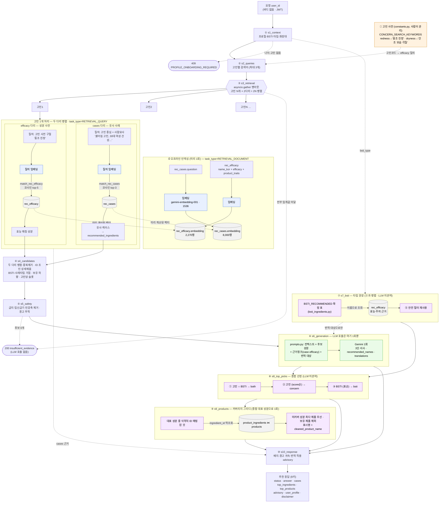

# 성분 추천(recommendations) 파이프라인 설계서

- **작성일**: 2026-07-10
- **최종 수정**: 2026-07-23 (코드 기준으로 전면 갱신 — 이전 판의 옛 단계 번호·옛 응답 계약·목표 다이어그램은 삭제)
- **작성자**: 김민경
- **대상 모듈**: `app/modules/recommendations` · 엔드포인트: `POST /api/v1/recommendations`
- **관련 문서**: 데이터·적재 [02](02-recommendations-data-spec.md) · 벡터 검색 [03](03-vector-retrieval.md) · 품질 개선 [04](04-recommendation-quality.md)

## 0. 한눈에 보기

- **하는 일**: 프로필(나이·성별·고민)·BSTI 타입·화장대 보유 성분을 서버가 DB에서 읽어,
  개인 맞춤 성분과 그 성분을 담은 제품을 이유·경고·근거와 함께 돌려준다. 요청 바디 없음.
- **왜 RAG인가**: LLM에 바로 추천을 시키면 환각이 난다. 신뢰 자료를 먼저 **검색**하고
  그 자료만 근거로 **생성**한다.
- **이중 인덱스**: 상담 사례 8,000건(`rec_cases`, "비슷한 사람은 어떤 답을 받았나") +
  성분 지식 2,270종(`rec_efficacy`, "이 고민에 듣는 성분은 뭔가").
- **구조**: 고정 시퀀스 10단계, **LLM 호출은 ⑥ 한 번뿐**이라 비용·지연이 예측 가능하다.
- **핵심 원칙**: 근거 없으면 생성하지 않는다 · 위험 성분은 거른다 · 정확해야 하는 값
  (성분 ID·경고·출처·제품)은 LLM이 아니라 코드가 붙인다.

## 1. 확정 결정

| 항목 | 결정 |
|---|---|
| 파이프라인 | 고정 시퀀스 10단계, LLM 1회 — 에이전트·LangGraph 미도입 |
| 검색 | 벡터 검색(`gemini-embedding-001` 1536차원, HNSW 코사인 RPC). 상세 03 |
| 인덱스 | 이중: `rec_cases`(사례) + `rec_efficacy`(성분 지식) |
| 입력 | 서버가 `user_profiles`·`user_shelf`에서 조회. 요청 바디 없음 |
| 온보딩 | 나이·고민 없으면 `409 PROFILE_ONBOARDING_REQUIRED` |
| BSTI | 축 서술은 `bsti_traits.py`, 타입 권장 성분은 코드 상수 `bsti_ingredients.BSTI_RECOMMENDED`(앱 `kBstiSkinTypes` 복제본). 기피 경고는 미도입 |
| 피부 고민 | 8종 enum, 요청당 최대 3개 |
| 출력 | 성분(고민 축 + BSTI 축 종합) + 그 성분 함유 제품. 제품은 코드 조인, LLM 미관여 |
| 화장대 | v1 포함 — 보유 성분은 **제외가 아니라 하향**(긍정 피드백 보존) + `owned` 표시. 비어 있으면 보정 없이 진행 |
| 안전성 | 식약처 `금지`=제외 / `한도`=경고 · 미매핑 명칭 보조 검사 · 알레르기 25종 · 임신수유 2단계 · 민감(S) 축 AND 규칙(04 §12) |
| 표시·광고 | 의약품적 효능 표현 금지 — 프롬프트 제약 + 사후 금칙어 검사·재생성 (화장품법 §13) |
| 모델 | `gemini-3.5-flash-lite`(Vertex, `settings.gemini_model` 단일 값) |

## 2. 파일 구성

`service.py`는 순서만 다루는 오케스트레이터이고 단계 구현은 `pipeline/`에 있다.
파일명 `s1`~`s10`이 실행 순서다(파이썬 모듈명이 숫자로 시작할 수 없어 `s` 접두).

```
app/modules/recommendations/
├── service.py         오케스트레이터 (순서·조기 종료·병렬 배치)
├── router.py          엔드포인트   · rate_limit.py  사용자당 호출 상한(429)
├── pipeline/
│   ├── s1_context.py     ① 컨텍스트 조립      ├── s6_generation.py  ⑥ 생성 (LLM 1회)
│   ├── s2_queries.py     ② 질의 구성          ├── s7_bsti.py        ⑦ BSTI 가지
│   ├── s3_retrieval.py   ③ 벡터 검색          ├── s8_top_picks.py   ⑧ 종합 추천
│   ├── s4_candidates.py  ④ 후보 집계          ├── s9_products.py    ⑨ 제품 추천
│   └── s5_safety.py      ⑤ 안전성 필터        └── s10_response.py   ⑩ 응답 조립
├── schemas.py         요청·응답·내부 모델      · constants.py  임계값·가중치·안전 목록
├── prompts.py         ⑥ 프롬프트               · embedding.py  질의 임베딩 (03 §2)
├── util/
│   ├── ingredient_names.py  성분명 정규화 (④⑤⑦⑩)
│   └── display_text.py      영어 조각 분할·번역 적용 (⑥⑩)
├── errors.py          409·429·502·503          · bsti_traits.py     축 코드 → 특성 서술
└── bsti_ingredients.py  타입별 권장 성분 표
```

단계끼리 직접 부르지 않는다. 예외는 ⑩이 ⑥의 금칙어 순화(`sanitize_claims`)를 재사용하는
것 하나뿐이다 — 같은 화장품법 규칙이라 두 벌로 두면 어긋난다.

## 3. 파이프라인 흐름



**③과 ⑦은 `asyncio.gather` 병렬**이다. ⑦은 `UserContext`에만 의존하고, ⑥ 프롬프트가
BSTI 축 성분의 영어 원문까지 번역시키려면 ⑥ 시작 시점에 이미 있어야 한다. ⑥ 앞에 순차로
붙이면 DB 왕복이 그대로 더해지므로 검색 대기에 흡수시킨다(04 §11-1).
**⑤는 두 축에 각각 1회씩** 돈다 — 합치면 BSTI 조회가 검색 뒤로 직렬화된다.
**⑨는 ⑧ 대표 성분으로 한 번만** 돈다 — 축별 제품 배열이 응답에서 빠지면서 3회가 1회로 줄었다.

Langfuse 트레이스는 ⑥ 생성 호출 1건이 남긴다(generation, metadata `module:recommendations` — 개인 속성은 마스킹). 나머지 단계는 애플리케이션 로그로 추적한다.

### 단계 요약

| 단계 | 핵심 동작 | 주요 상수 |
|---|---|---|
| ① 컨텍스트 | `user_profiles`(나이·성별·고민·`bsti_type`·임신/수유) + `user_shelf` 조회. BSTI 타입 4글자를 축(O/D·S/R·P/N·W/T)으로 분해해 검색용 서술을 만들고, 타입 권장 성분은 `BSTI_RECOMMENDED`에서 읽는다. 화장대·BSTI 없으면 우아한 축소 | `MAX_CONCERNS=3` |
| ② 질의 | 고민별 질의 2종. cases leg = 고민 중심 + 인구·축 서술, efficacy leg = `CONCERN_SEARCH_KEYWORDS`의 짧은 구절 | — |
| ③ 검색 | 질의 임베딩 → `match_rec_cases`/`match_rec_efficacy` RPC. 고민 N × 2 leg 병렬. score 컷은 호출자가 수행 | `CASES_TOP_K=3` `EFFICACY_TOP_K=5` `MIN_RETRIEVAL_SCORE=0.5` |
| ④ 후보 집계 | score순 union·dedupe(최고 score 유지, `concerns` 합집합) → `ingredient_id` 조인 → **조인 뒤** BSTI 가점·사례 피부타입 가점·보유 하향 → 고민당 최소 슬롯 예약 → 상한 절단. 동점 정렬은 `(-score, name_kor)` 전순서로 고정(04 §9) | `BSTI_BOOST=0.15` `CASE_SKIN_TYPE_BOOST=0.05` `OWNED_PENALTY=0.1` `MAX_CANDIDATES=12` `MIN_CANDIDATES_PER_CONCERN=2` |
| ⑤ 안전 필터 | 아래 §4 | — |
| ⑥ 생성 | LLM 호출 **1회**. 근거 청크 + UserContext로 3단 서사(`cause_analysis`·`recommendation`·`usage_guide`) + `recommended_names` + 영어 조각 번역을 `response_schema`로 강제. 후보 밖 성분은 버린다(환각 차단). 금칙어·추천 수 미달·고민 커버리지 미달은 재생성 사유 | `MIN/MAX_RECOMMENDED=3` `MAX_EVIDENCE_CHARS=12000` `GENERATION_TIMEOUT_SECONDS=30` `TEMPERATURE=0.0` + `SEED` |
| ⑦ BSTI 가지 | `BSTI_RECOMMENDED` 표 → `rec_efficacy` 이름 조회로 효능·주의 부착. 검색이 아니라 확정 매칭이라 `similarity=null`. LLM 미관여 | — |
| ⑧ 종합 | 고민 축 ∩ BSTI = `both` → 고민 축(score순) = `concern` → BSTI 표 순서 = `bsti`. 고민 축 상한을 둬 BSTI 몫을 남긴다 | `MAX_TOP_INGREDIENTS=5` `MAX_TOP_CONCERN_INGREDIENTS=3` |
| ⑨ 제품 | 대표 성분 → `product_ingredients` 역조회 → 커버리지 그리디(04 §4). 보유 제품 제외. 실패·0건은 빈 목록 | `MAX_RECOMMENDED_PRODUCTS=5` `PRODUCT_FETCH_LIMIT=500` |
| ⑩ 응답 | 기능성 고시 배지·`owned`·경고·번역 적용·`match_source` 부착, advisory 판정 | `FUNCTIONAL_NOTICE_BADGES` |

**LLM이 만드는 것과 코드가 붙이는 것**: LLM은 서사·추천 성분명·번역만. `ingredient_id`·
`inci`·`efficacy`·`badges`·`warnings`·제품·유사도는 전부 코드가 조립한다.

## 4. 안전성 필터 (⑤)

| 검사 | 소스 | 동작 |
|---|---|---|
| 사용제한 | `restrictions` (`ingredient_id` 조인) | `금지`=제거+로그 / `한도`=유지+`limit_cond` 경고 |
| 미매핑 보조 | `restrictions.name_kor`·`notice_ingr_name` 명칭 매칭 | `ingredient_id` NULL 후보는 조인을 우회하므로 명칭으로 재검사. 그래도 불가면 `안전성확인불가` 경고 |
| 착향 알레르기 | `ALLERGEN_INGREDIENTS` 25종 (식약처 고시) | 경고 — S(민감) 축이면 강조 |
| 성분 주의 | `rec_efficacy.safety_note`·`recommended_concentration` | 경고 보조 근거 |
| 임신·수유 | `PREGNANCY_AVOID`(레티노이드) / `PREGNANCY_CAUTION`(살리실릭애씨드) | AVOID: 플래그 true=제거, unknown=경고 / CAUTION: 경고만 |
| 민감(S) 축 | `한도` 등재 **AND** `safety_note`가 자극·알레르기 위험 서술 | 후보 제거. 안전 서술이 섞여 있으면 물린다 (04 §12) |
| 고민 상충 | `recommended_skin_types` ↔ 동반 고민 (`CONFLICTING_CONCERNS`) | 경고 |

`restrictions`가 0행이어도 코드는 동작한다(조인 결과 없음 = 통과). 단 **적재 완료를 배포
전 체크리스트에 포함**한다. 필터 후 후보 0개면 확인 불가 응답.

### 임신·수유 성분 근거 (2026-07-20 조사)

**국내 규제 근거는 없다.** 「화장품 안전기준 등에 관한 규정」의 원료 규제 축은 사용금지
원료(별표 1)·사용제한 원료(별표 2) 둘뿐이고 **사용자 집단(임부·수유부)별 축이 없다**.
아래는 해외 근거 기반 자체 판단이며 사용자에게 "식약처 기준"으로 표시하면 안 된다.

| 단계 | 성분 | 근거 요지 |
|---|---|---|
| 제외 | 레티노이드 | 국소 노출에서 위험 증가 미확인(PMID 22174426·15940677)이나 두 논문 모두 저자 결론이 "임신 중 사용은 권고되지 않음" → 사유는 "금기"가 아니라 **"권고되지 않음"** |
| 경고 | 살리실릭애씨드 | EU CLP Repr. 2 분류이나 같은 SCCS 의견서가 농도 조건부 허용·임부 제한 없음. MotherSafe는 임신 중 안전으로 봄. 우리 데이터에 제품 내 농도가 없어 농도 판단 불가 → 경고만 |

미확인: 별표 1·2 원문(첨부파일). `restrictions` 적재 시 데이터로 자동 확인된다. 정유
계열은 조사 범위 밖 — 출시 전 전문가 검토 권장.

## 5. API 계약

`POST /api/v1/recommendations` — `Authorization: Bearer <Supabase JWT>` 필수, **요청 바디 없음**.
스키마 원본은 `schemas.py::RecommendationResponse`.

### 응답 (200) — 최상위 8키, 이 순서

| 필드 | 타입 | 설명 |
|---|---|---|
| `status` | string | `ok` \| `insufficient_evidence` (확인 불가 — 에러 아닌 정형 응답) |
| `answer` | object \| null | 3단 서사 `cause_analysis`·`recommendation`·`usage_guide` (확인 불가 시 null) |
| `cases` | array | 근거 보기 — 유사 사례 (`id`·`target_concern`·`gender`·`age`·`skin_type`·`recommended_ingredients`·`similarity`·`question`·`answer`) |
| `top_ingredients` | array | **메인 카드** — 고민 축 + BSTI 축 종합 대표 성분 (아래) |
| `top_products` | array | 대표 성분 함유 제품 (`product_id`·`product_name`·`brand`·`product_url`·`main_category`·`matched_ingredients`·`match_source`) |
| `advisory` | object \| null | 근거 알림 `{code, message, action?}` — `weak_evidence` \| `partial_evidence` \| `no_evidence` \| `no_candidates`. 알릴 게 없으면 null |
| `user_profile` | object | 사용된 컨텍스트 (`age`·`gender`·`bsti_type`·`concerns`) |
| `disclaimer` | string | "의학적 진단이 아닌 참고 정보" 고지 |

`top_ingredients[]` 항목:

| 필드 | 타입 | 설명 |
|---|---|---|
| `name_kor` / `inci` | string / string\|null | 성분명 (미매핑이면 `inci` null) |
| `similarity` | float \| null | 검색 코사인 유사도. **null = 표(BSTI) 기반 매칭** — 검색값이 아니라서 비운다 |
| `efficacy` / `safety_note` / `concentration` | string \| null | `rec_efficacy` 원문 (영어 조각은 ⑥ 번역 적용, 실패 시 삭제 안전망) |
| `badges` | string[] | 기능성 고시 배지 (예: `기능성고시_미백`) |
| `owned` / `owned_products` | bool / string[] | 화장대 보유 여부 + 해당 보유 제품명 |
| `warnings` | array | `{type, text}` — `한도` \| `알레르기유발` \| `안전성확인불가` \| `임신수유주의` \| `고민상충`. 서술형 주의(`주의사항` 타입)는 ⑤가 만들어 ⑥ 프롬프트에만 쓰고 응답에서는 `safety_note`·`concentration` 필드가 대신한다. `regulation_note`(수출·배합 규제, 제조 관점 — 유의미 380/2,270행)는 내부 소비 전용이라 응답에 싣지 않는다 |
| `match_source` | string \| null | `both`(고민+타입) \| `concern` \| `bsti` — 프론트 배지용 |

성분 ID는 응답에 싣지 않는다. 축별 배열(`ingredients`·`products`·`bsti_*`)과
`retrieval_mode`는 2026-07-23 계약에서 제거됐다 — 축 구분은 `match_source`가 대신한다.

### 에러 — 공통 포맷 `{"error": {"code", "message"}}`

| 상태 | code | 상황 |
|---|---|---|
| 401 | `AUTH_MISSING_TOKEN` / `AUTH_INVALID_TOKEN` | JWT 없음·무효 |
| 409 | `PROFILE_ONBOARDING_REQUIRED` | 나이 또는 고민 없음 → 온보딩 유도 |
| 429 | `RATE_LIMITED` | 사용자당 `RATE_LIMIT_MAX=10`회/`60초` 초과 |
| 502 | `LLM_UPSTREAM_ERROR` | Gemini 호출 실패 (재시도 후) |
| 503 | `DB_UNAVAILABLE` | Supabase 연결 실패 |

## 6. 엣지 케이스

- 검색 결과 전부 임계값 미달 → 생성 호출 없이 확인 불가 (`no_evidence`)
- 안전 필터 후 후보 0개 → 확인 불가 (`no_candidates`) + 제거 사유 로그
- 일부 고민만 근거 0건 → 추천은 하되 `advisory.partial_evidence`로 그 고민을 지목
- BSTI 없음 → BSTI 요소만 생략 / 온보딩 미완 → 409
- 화장대 비어 있음·`user_shelf` 미구현 → 보정(하향·표시)만 생략
- 보유 제품이 `products`에 없으면 성분 전개 불가 — 성분 직접 등록이 보완 수단
- ⑥ 재생성 실패 → 1차 결과를 순화해 사용(버리면 근거가 있는데도 확인 불가가 된다)
- ⑨ 조회 실패·0건 → 빈 목록 (제품은 부가 정보라 성분 추천을 깨뜨리지 않는다)

## 7. 규칙 준수 매핑

[llm-rag-rules.md](../rules/llm-rag-rules.md) 대비 — 근거 기반 생성·확인 불가 정형 응답,
출처 포함(`cases`), injection 방어(사용자 값 데이터 블록 격리), Langfuse 필수, 비용 보호
(검색 상한·후보 상한·생성 스킵). 모델은 규칙상 Pro 기준에 해당하나 Pro 실측 지연(~15초)이
30초 타임아웃을 넘겨 502가 나므로 flash-lite로 운용한다 — **의도된 예외**.

## 8. 미결 항목

| 항목 | 상대 | 내용 | 미결 시 기본값 |
|---|---|---|---|
| 응답 지연 UX | 박금별·프론트 | 스트리밍 없음·캐시 없음. **서버 타임아웃 30초, 재시도 포함 60초 — 프론트 로딩 타임아웃은 이보다 길어야 한다** | 동시요청 정책은 v1.1 |
| PMID 출처 표기 | 박금별·프론트 | `PMID:...`는 소비자에게 소음 — "임상 연구 N건" + 링크 권장 | 개수만 표기, locator는 상세 화면 |
| 임계값·가중치 튜닝 | 내부 | `MIN_RETRIEVAL_SCORE`·`BSTI_BOOST`·`CASE_SKIN_TYPE_BOOST`는 잠정치 | Langfuse 실측 분포로 조정 |
| 성분 궁합·충돌 | 내부 | 레티놀+AHA 등 상호작용 근거 데이터 없음 | v1.1+ 미도입 |
| 응답 캐시 | 내부 | 제공자 측 비결정성은 앱 코드로 못 닫는다 — 하드 보장은 캐시뿐 (04 §9) | v1.1 |
| 품질 평가 | 내부 | AI Hub Validation 1,000건 held-out으로 recall@k + groundedness LLM-as-judge | 설계만, 구현 후속 |

## 구성 근거

- 고정 시퀀스: LLM 1회로 비용·지연이 예측 가능하고 단계별 테스트가 쉽다. function calling
  에이전트는 호출 횟수 비결정성, 케이스 재사용안은 출처 규칙 위반으로 버렸다.
- BSTI 매핑을 앱 정의(`kBstiSkinTypes`)의 코드 상수 복제본으로 소비: 같은 매핑을 여러 곳에서
  관리하면 "BSTI 결과는 권장인데 추천은 경고"라는 모순이 필연이다.
- 보유 성분을 제외가 아니라 하향: 빼버리면 "잘 쓰고 계세요"라는 긍정 신호를 못 준다.
- 안전·법규(임신 금기·표시광고)를 `restrictions` 적재와 같은 급의 배포 게이트로 다룬 이유:
  disclaimer로 방어되지 않는 실질 위해·법 위반이기 때문. 단 플래그 미수집 상태에선 과차단을
  피해 경고로 축소한다.
