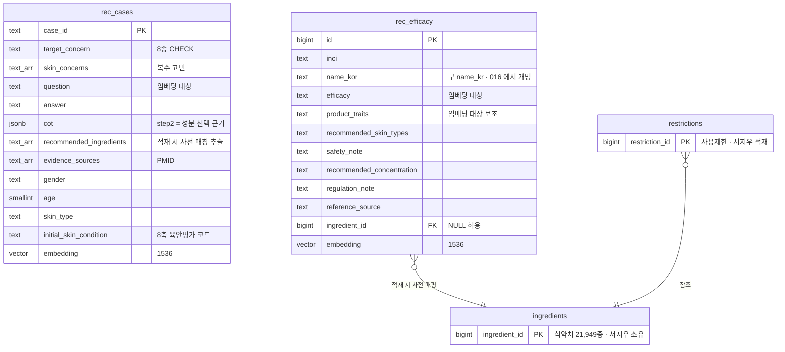

# 성분 추천(recommendations) 데이터 명세서

- **작성일**: 2026-07-10
- **최종 수정**: 2026-07-23 (컬럼 개명·임베딩 담당 이관 반영, 서술 축약)
- **작성자**: 김민경
- **네이밍**: 테이블 prefix는 `rec_`(recommendations 도메인) — 소스명(ai_hub)을 넣지 않아 데이터 소스가 바뀌어도 이름이 유지된다

파이프라인([01](01-recommendations-pipeline.md))이 쓰는 데이터의 테이블·적재·참조 상수를
정의한다. 임베딩·검색 RPC는 [03](03-vector-retrieval.md)으로 분리됐다.

## 0. 한눈에 보기

- **두 종류를 검색해 쓴다**: 상담 사례 8,000건(`rec_cases`) + 성분 지식(`rec_efficacy`,
  원본 2,465종 → 중복 제거 후 적재 2,270행). 둘 다 AI Hub dataSetSn=71886.
- **보유 제품 성분도 입력이다**: 화장대(`user_shelf`)에 등록된 제품·성분을 읽어 "지금 루틴에
  없는 성분"을 우선한다 — 전용 테이블 없이 `user_shelf`·`product_ingredients` 조인으로 해결.
- **왜 식약처 성분 테이블과 따로 두나**: `ingredients`는 "공식 원료 사전", `rec_efficacy`는
  "추천용 효능 지식"으로 성격이 다르다. 합치지 않고 `ingredient_id`로 연결한다.
- **담당**: 데이터 정규화·적재·임베딩 모두 김민경 (임베딩은 2026-07-23 서지우→김민경 이관).

## 1. 데이터 소스 현황

> AI Hub 소개의 "10,000건"은 전체 구축량(80/10/10 = Training 8,000 / Validation 1,000 /
> Test 1,000)이다. **개방 다운로드에 Test 1,000건이 없어** 실제 수령분은 9,000건이며 로컬
> zip 전수 집계로 확인했다. Test 부재로 아래 Validation 보존 방침이 유일한 평가셋이 된다.

| 구성 | 내용 | 처리 |
|---|---|---|
| Training 라벨링 8,000건 | question·answer·CoT 3단계·PMID 근거·meta(성별/나이/피부타입/고민) | **적재** → `rec_cases` |
| 지식성분데이터.xlsx 2,465종 | INCI·한글명·효능·물성·권장피부타입·주의사항·권장농도·배합규제·참고문헌 | **적재** → `rec_efficacy` (`(inci, name_kor)` 중복 제거 후 2,270행) |
| Validation 1,000건 | Training과 동일 구조 | **미적재** — 품질 평가용 held-out (과각질 0건·민감성 1건: 커버리지 한계) |
| 원천데이터 | 설문 CSV + 얼굴 사진 | **미적재** — 설문 정보는 라벨링 meta에 포함, 이미지 기능은 스코프 밖 |

**케이스의 고민별 분포는 극도로 불균형** — 희소 고민 대응(04 §2-1)이 필요한 근거:

| 고민 | 건수 | 고민 | 건수 |
|---|---|---|---|
| 모공 | 2,738 | 여드름 | 747 |
| 미백 | 2,564 | 홍조 | 136 |
| 주름 | 1,701 | 과각질/악건성 | 61 |
| 피부처짐/탄력 | 47 | 민감성 | 6 |

**이용 범위 [검증 필요]**: 학습·연구 목적 승인과 별개로, **상업 서비스에서 파생물(추천
근거·성분 목록·케이스 답변)을 최종 사용자에게 서빙**해도 되는지 dataSetSn=71886의 이용조건을
배포 전 확인해 근거를 남긴다 (`restrictions` 적재와 함께 배포 전 체크리스트).

## 2. 테이블 구조

두 테이블 모두 `supabase/migrations`로 관리(김민경), RLS 활성화 + service role만 접근.
`rec_efficacy`에는 물성 원본(`properties`·`solubility`·`formula`·`weight`·`source`)도 보존한다.

**컬럼 개명(016)**: `rec_efficacy.name_kr` → `name_kor`. `ingredients`가 이미 `name_kor`이라
표기를 통일했다. `returns table`의 컬럼명 변경은 `create or replace`가 거부하므로
`match_rec_efficacy` RPC를 drop 후 재생성한다 — 빠뜨리면 ③ 벡터 검색이 즉시 깨진다.

### 제약·멱등 키

| 테이블 | 제약 | 이유 |
|---|---|---|
| `rec_cases` | PK `case_id` = upsert conflict target / `target_concern`·`question`·`answer` NOT NULL + 8종 CHECK | 원본 id가 자연 키 — 재실행 시 자동 멱등 |
| `rec_efficacy` | **`UNIQUE(inci, name_kor)` = conflict target** / `CHECK (inci IS NOT NULL OR name_kor IS NOT NULL)` / `efficacy` NOT NULL | PK가 자동생성 `id`라 conflict target 없이는 재실행마다 2,465행이 중복 적재되어 검색이 오염된다 |

### 임베딩 대상 선정

한 행의 모든 칸을 임베딩하지 않는다. **질의와 의미로 비교될 텍스트만** 임베딩하고 나머지는
필터·페이로드로 쓴다.

| 테이블 | 대상 | 이유 |
|---|---|---|
| `rec_cases` | `question`만 | 질의가 "상황 서술"이라 비교 대상도 상황 서술이어야 한다. answer(해결책)를 섞으면 상황↔상황 매칭이 상황↔해법 매칭으로 오염된다 |
| `rec_efficacy` | `name_kor + efficacy + product_traits` | "고민 → 효능" 질의와 맞아야 하므로 효능이 핵심. 물성·분자식·용해도는 노이즈라 제외(저장은 하되 임베딩엔 안 넣음) |

`ingredients`(식약처)와 `rec_efficacy`는 **성분명만 겹치고 내용은 상보적**이다. 병합하면
sparse 컬럼(21,949 중 2,270만 채움)·소유권 혼합·임베딩 용도 충돌이 생기므로 분리 유지 +
`ingredient_id` FK로 연결한다. 프론트 명세의 통합 `ingredients` 필드는 성분 상세 API가
**조인한 응답 형태**로 제공한다 — 테이블 병합 아님.

## 3. 적재 파이프라인 (`scripts/load_recommendations_data.py`, 멱등)

원본 정규화(8,000 + 2,465) → `recommended_ingredients` 사전 매칭 추출 → `ingredient_id` 매핑
→ upsert(embedding NULL) → `scripts/backfill_rec_embeddings.py`로 임베딩 적재(03 §2).

- PoC(`skincare-rag-poc/prepare_data.py`) 정규화 로직 재활용. PoC `COLUMN_MAP`이 xlsx 컬럼
  9개만 다뤘으므로 권장피부타입·주의사항·권장농도·배합규제·참고문헌 5개를 추가한다.
- **성분 추출**: 2,465종 성분명(INCI+한글) 사전으로 `answer + CoT step2`에서 사전 매칭.
  따옴표 표기 파싱은 불가 — 답변 450건 중 67%가 따옴표 표기 0개.
- **`ingredient_id` 매핑**: `name_kor` 정확 일치 → `synonyms` 순서, 미매칭 NULL 허용.
- 실행 후 리포트: 적재 건수, 고민별 분포, **연령·성별 분포**(소수 집단은 임계값을 넘겨도
  인구통계 불일치로 나쁜 매칭이 될 수 있어 편중을 미리 파악), `ingredient_id` 매칭률, 성분
  추출 0건 케이스 수, **PMID 스팟체크**(틀린 인용을 임상 근거로 노출하는 것 방지).

## 4. 참조 상수 (코드 관리, DB 아님)

| 상수 | 위치 | 내용 |
|---|---|---|
| 피부 고민 8종 | `app/common/skin_concerns.py` | 코드↔한글 라벨. 온보딩·추천 공용. DB `target_concern`은 원본 한글 라벨 유지 |
| BSTI 축 사전 | `bsti_traits.py` | 8축 코드(O/D·S/R·P/N·W/T) → 특성 서술. 질의 구성·사례 피부타입 매핑용 |
| BSTI 타입 권장 성분 | `bsti_ingredients.py` (`BSTI_RECOMMENDED`) | 앱 `kBstiSkinTypes` 복제본. ⑦ BSTI 가지·④ 가점이 소비 |
| 기능성 고시원료 | `constants.py` (`FUNCTIONAL_NOTICE_BADGES`) | 미백·주름개선 고시 성분 → 배지. **고시 함량은 응답 계약에 필드가 없어 제외**, 자외선차단 보강은 v1.1 |
| 알레르기 유발성분 25종 | `constants.py` (`ALLERGEN_INGREDIENTS`) | 착향제 25종 고시. 경고용 |
| 임신·수유 주의 | `constants.py` (`PREGNANCY_AVOID`·`PREGNANCY_CAUTION`) | 제외=레티노이드 / 경고=살리실릭애씨드. **국내 규제 근거 없음** — 근거 전문은 01 §4 |

고시 기반 고정 목록은 수십 종 이하라 DB 없이 상수로 두고 개정 시 git으로 추적한다.

## 5. 의존 계약 (타 모듈 소유)

| 테이블 | 소유 | 요구사항 |
|---|---|---|
| `user_profiles` | 김민경(회원) | `user_id`·`age`·`gender`·`skin_concerns[]`·`bsti_type`. **임신·수유 플래그는 안전 필터용으로 정식 공개 전 수집 필요** — 미수집 시 `unknown` 경로 |
| BSTI | 박금별 | **DB 의존 없음** — `bsti_results` 테이블은 존재하지 않고, 박금별 3단 조인 테이블도 미머지라 코드 상수 `BSTI_RECOMMENDED`를 앱 정의의 복제본으로 쓰기로 확정했다. 타입 코드는 `user_profiles.bsti_type`에서 읽는다 |
| `user_shelf` | 김민경(화장대) | **컬럼 미확정**. 코드는 `item_type(product/ingredient)`·`product_id`·`ingredient_name`을 가정 — 박금별과 확정 필요. 미구현·빈 상태여도 파이프라인 동작(보정만 생략) |
| `products`·`product_ingredients` | 서지우 | 보유 제품 → 성분 전개, ⑨ 제품 역조회. 구조는 [supabase/schema.md](../../supabase/schema.md) |
| `restrictions` | 서지우 | `regulate_type(금지/한도)`·`limit_cond`. 적재 전에도 동작(0행=통과)이나 **적재 완료가 배포 조건** |
| `ingredients`·`synonyms` | 서지우 | `ingredient_id` 매핑·조인 대상 |

## 6. 검토 후 제외한 데이터 후보 (기록)

- 기능성화장품 보고품목정보 API(15095680) — 제품 단위, v1 스코프 밖
- CosIng(EU)·INCIDecoder·EWG — 영문 매핑 비용 큼, EWG 라이선스 불명확, AI Hub 효능과 중복
- 화해 등 리뷰 크롤링 — 약관·저작권 리스크 대비 효익 낮음
- PubMed 초록 인덱싱 — 케이스에 PMID가 전 건 있어 링크 표기로 충분

## 구성 근거

- 테이블을 소스 단위로 나누고 식약처 테이블과 분리한 것은 소유권·적재 주기·임베딩 용도가
  다르기 때문. 통합은 조인·응답 계층에서 한다.
- 임베딩을 공유 인프라(서지우)에 맡기려던 초기 분담은 일정·계약 미확정으로 추천 모듈 소유로
  이관했다(03 §0) — 코퍼스와 질의가 같은 임베더를 쓰게 되어 drift도 함께 닫혔다.
- 고시 목록을 DB가 아닌 상수로 둔 것은 규모(수십 종)와 변경 빈도(고시 개정 시에만)를 고려 —
  마이그레이션 없이 git 리뷰로 관리하는 편이 가볍다.
