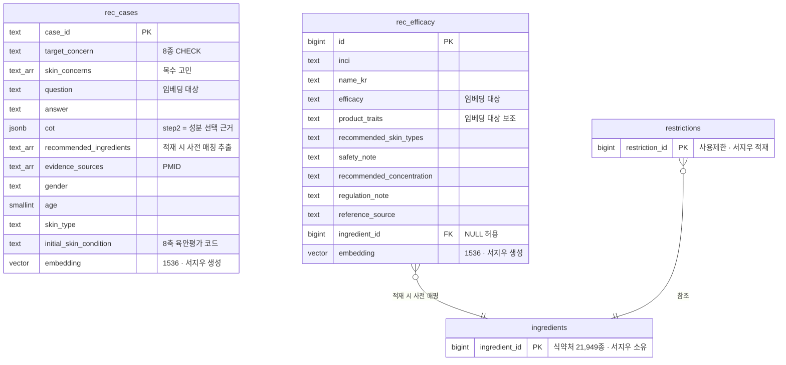
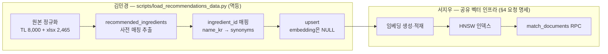

# 성분 추천(recommendations) 데이터 명세서

- **작성일**: 2026-07-10
- **작성자**: 김민경
- **네이밍**: 테이블·컬렉션 prefix는 `rec_`(recommendations 도메인) — 소스명(ai_hub)을 넣지 않아 데이터 소스가 바뀌어도 이름이 유지된다

성분 추천 파이프라인([01-recommendations-pipeline.md](01-recommendations-pipeline.md))이
사용하는 데이터의 테이블·적재·참조 상수를 정의하고, **임베딩·인덱싱·검색 RPC에
대한 서지우 요청 명세(§4)**를 포함한다. AI Hub "스킨케어 성분-효능 추천
데이터"(dataSetSn=71886)의 정규화·적재는 김민경 담당 (데이터 소유자).

## 0. 한눈에 보기

- **두 종류의 데이터를 검색해 쓴다**: 상담 사례 8,000건(`rec_cases` — "나와 비슷한
  사람은 어떤 답을 받았나")과 성분 지식 2,465종(`rec_efficacy` — "이 고민에 효과 있는
  성분은 뭔가"). 둘 다 AI Hub 공공데이터(dataSetSn=71886)에서 온다.
- **임베딩이란**: 문장을 컴퓨터가 "의미"로 비교하도록 숫자 좌표(벡터)로 바꾼 것. 이
  좌표가 있어야 "모공 넓어짐"과 "모공이 커 보임"을 비슷한 뜻으로 검색할 수 있다.
- **역할 분담**: 김민경이 데이터를 다듬어 저장(임베딩 칸은 비움)하는 데까지, 그 뒤
  임베딩 생성·검색 인덱스·검색 함수(RPC)는 공유 벡터 인프라 소유자인 서지우가 맡는다
  (§3·§4).
- **보유 제품 성분도 입력이다 (2026-07-10 결정)**: 추천이 사용자의 화장대
  (`user_shelf`)에 등록된 제품·성분을 읽어 "지금 루틴에 없는 성분"을 우선한다 —
  전용 테이블을 새로 만들지 않고 기존 `user_shelf`·`product_ingredients` 조인으로
  해결한다 (§6 의존 계약).
- **왜 기존 성분 테이블과 따로 두나**: 식약처 `ingredients`는 "공식 원료 사전",
  `rec_efficacy`는 "추천용 효능 지식"으로 성격이 다르다. 합치지 않고 `ingredient_id`로
  연결한다 (§3).

## 1. 데이터 소스 현황 (전수 점검 완료, 2026-07-10)

> AI Hub 소개 페이지의 "10,000건"은 전체 구축량이다 (80/10/10 분할 = Training 8,000 /
> Validation 1,000 / Test 1,000). **개방 다운로드에는 Test 1,000건이 포함되지 않아**
> 실제 수령분은 9,000건이며, 로컬 zip 전수 집계로 확인했다 (라벨링·원천 모두 동일).
> Test 부재로 인해 아래 Validation 1,000건 보존 방침이 우리가 가진 유일한 평가셋이 된다.

| 구성 | 내용 | 처리 방침 |
|---|---|---|
| Training 라벨링 (TL_*) 8,000건 | 상담 케이스 JSONL — question·answer·CoT 3단계·PMID 근거·meta(성별/나이/피부타입/고민) | **적재** → `rec_cases` |
| 지식성분데이터.xlsx 2,465종 | 성분별 INCI·한글명·효능·물성·권장피부타입·주의사항·권장농도·배합규제·참고문헌 | **적재** → `rec_efficacy` |
| Validation 라벨링 (VL_*) 1,000건 | Training과 동일 구조 | **미적재 — 추천 품질 평가용 held-out 보존** (과각질 0건·민감성 1건: 커버리지 한계 기록) |
| 원천데이터 (TS_/VS_) | 설문 CSV + 얼굴 사진 JPG | **미적재** — 설문 정보는 라벨링 meta에 포함, 이미지 기능은 픽스에서 제외. CSV 헤더는 `initial_skin_condition` 8축 코드 해석 근거로만 참고 |
| Other.zip | 지식성분데이터.xlsx 중복본 | 무시 |

**Training 케이스의 고민별 분포는 극도로 불균형** — 파이프라인의 희소 고민 보완(01 §2-③)이 필요한 근거:

| 고민 | 건수 | 고민 | 건수 |
|---|---|---|---|
| 모공 | 2,738 | 여드름 | 747 |
| 미백 | 2,564 | 홍조 | 136 |
| 주름 | 1,701 | 과각질/악건성 | 61 |
| 피부처짐/탄력 | 47 | 민감성 | 6 |

**이용 범위 확인 (출시 조건) [검증 필요]**: AI Hub는 데이터셋마다 이용허락범위가
다르다. 학습·연구 목적 신청·승인과 별개로, **상업 서비스에서 파생물(추천 근거·성분
목록·케이스 답변)을 최종 사용자에게 서빙**해도 되는지 dataSetSn=71886의 이용조건을
배포 전 확인해 근거를 남긴다 (`restrictions` 적재와 함께 배포 전 체크리스트).

## 2. 테이블 구조

두 테이블 모두 `supabase/migrations`로 관리(김민경), RLS 활성화 + service role만
접근(기존 테이블과 동일 정책). `rec_efficacy`에는 물성 원본 컬럼
(`properties`·`solubility`·`formula`·`weight`·`source`)도 페이로드로 보존한다.

### 제약·멱등 키 (마이그레이션 필수 반영)

| 테이블 | 제약 | 이유 |
|---|---|---|
| `rec_cases` | PK `case_id` = upsert conflict target / `target_concern`·`question`·`answer` NOT NULL + 8종 CHECK | AI Hub 원본 id가 자연 키 — 재실행 시 자동 멱등 |
| `rec_efficacy` | **`UNIQUE(inci, name_kr)` = upsert conflict target** / `CHECK (inci IS NOT NULL OR name_kr IS NOT NULL)` / `efficacy` NOT NULL | PK가 자동생성 `id`라 conflict target 없이는 **재실행마다 2,465행이 중복 적재**되어 검색이 오염된다 |

> **멱등이란**: 적재 스크립트를 실수로 두 번 돌려도 결과가 같도록 "중복 판단 기준"을
> 둔 것. `rec_cases`는 원본 id(`case_id`)가 자연히 그 역할을 하지만, `rec_efficacy`는
> 위 `UNIQUE` 제약이 없으면 재실행 때마다 2,465행이 통째로 또 쌓인다.

### 임베딩 대상 선정 원칙

한 행의 모든 칸을 임베딩하지 않는다. **사용자 질의와 의미로 비교될 텍스트만 임베딩**
하고(그래야 검색이 정확하다), 나머지는 검색을 걸러내는 메타데이터 필터나 LLM에 보여줄
생성 페이로드로 쓴다.

| 테이블 | 임베딩 대상 | 이유 |
|---|---|---|
| `rec_cases` | `question`만 | 검색 질의가 "사용자 상황 서술"이므로 비교 대상도 상황 서술이어야 한다. answer(해결책)를 섞으면 상황↔상황 매칭이 상황↔해법 매칭으로 오염된다 |
| `rec_efficacy` | `name_kr + efficacy + product_traits` 결합 | "고민 → 효능" 질의와 맞아야 하므로 효능이 핵심. 화학적물성·분자식·분자량·용해도는 의미 검색에 노이즈라 제외(저장은 하되 임베딩엔 안 넣음) |

### 기존 `ingredients` 테이블과의 관계

`ingredients`(식약처, 서지우 소유)와 `rec_efficacy`는 **성분명만 겹치고 내용은
상보적**이다 (공식 원료 사전 vs 추천용 효능 지식). 병합하지 않고 분리 유지 +
`ingredient_id` FK 연결 — 병합 시 sparse 컬럼(21,949 중 2,465만 채움), 소유권
혼합, 임베딩 용도 충돌(해설용 vs 추천용)이 생긴다. 프론트 명세(박금별)의 통합
`ingredients` 필드는 성분 상세 API가 **조인한 응답 형태**로 제공한다 — 테이블
병합 아님 (박영기·이호영·서지우 공유 필요).

## 3. 적재 파이프라인 — 김민경·서지우 역할 분담

김민경 몫의 세부:

- PoC(`skincare-rag-poc/prepare_data.py`) 정규화 로직 재활용. 단 PoC `COLUMN_MAP`은
  xlsx 컬럼 9개만 다뤘으므로 권장피부타입·사용상주의사항·권장농도·배합규제·참고문헌
  5개를 추가한다.
- **recommended_ingredients 추출**: 지식성분데이터 2,465종 성분명(INCI+한글명)
  사전으로 `answer + CoT step2` 텍스트에서 사전 매칭. 따옴표 표기 파싱은 불가 —
  검증 결과 답변 450건 중 67%가 따옴표 표기 0개.
- **ingredient_id 매핑**: `name_kr` 정확 일치 → `synonyms` 순서, 미매칭 NULL 허용.
- **upsert**는 위 "제약·멱등 키" 표의 conflict target 기준 — 재실행이 안전하다.
- 실행 후 리포트: 적재 건수, 고민별 분포, **연령·성별 분포**(demographic skew
  사각지대 — 소수 집단은 검색 임계값을 넘겨도 인구통계 불일치로 나쁜 매칭이 될 수
  있어, 편중을 미리 파악한다), ingredient_id 매칭률, 성분 추출 0건 케이스 수,
  **PMID 근거 스팟체크**(`evidence_sources` 표본 수십 건을 실제 논문과 대조 —
  틀린 인용을 임상 근거로 사용자에게 노출하는 것을 방지).

## 4. 서지우 요청 명세 — 임베딩·인덱싱·검색 RPC

임베딩은 공유 벡터 인프라 소유자인 서지우의 역할이다. 아래를 요청하며, 시그니처
동결은 서지우가 발행한다. 기한은 중간발표(7/16) 역산 제안이며, **지연 시 폴백:
김민경이 `app/core/gemini.py` 경유 임시 임베딩 스크립트로 대체 적재 후, 서지우
인프라 완성 시 교체한다** (호출부 무변경).

| # | 요청 | 내용 | 기한(제안) |
|---|---|---|---|
| 1 | 모델·차원 확정 | Gemini 임베딩 + **1536 차원** — 기존 `ingredients.embedding vector(1536)`과 통일. 1536이 의도된 선택인지 확인. 근거: Gemini MRL 공식 지원 차원(3072/1536/768) 중 하나이고, pgvector HNSW는 `vector` 타입 최대 2,000차원(3072는 halfvec 우회 필요). **현재 전 테이블 임베딩 0행 — 지금이 차원 변경 가능한 마지막 시점** | **7/11** |
| 2 | RPC 시그니처 동결 | 요구 인터페이스: `(collection, query_embedding, filters jsonb, match_count) → (content, score 0~1, source, metadata)`. collection 값 `rec_cases`·`rec_efficacy` 라우팅 추가 | 7/12 |
| 3 | **metadata 필수 키** | 파이프라인이 retrieve() 결과만으로 후보 집계·안전 필터를 수행하므로, metadata에 반드시 포함: 케이스 → `recommended_ingredients`·`skin_concerns`, 효능 → `ingredient_id`·`safety_note`·`recommended_concentration`·`regulation_note` | 7/12 (2와 함께) |
| 4 | 필터 의미 | `rec_cases`의 고민 필터는 `skin_concerns` **배열 겹침 매칭** (희소 고민 대응) — filters 키·의미 합의 | 7/12 (2와 함께) |
| 5 | 질의 임베딩 재사용 | 동일 질의로 두 컬렉션을 검색하므로 임베딩 중복 방지 방안 협의 — retrieve()에 사전 계산 임베딩 전달 옵션 또는 유틸 내부 캐시 | 7/12 (2와 함께) |
| 6 | 임베딩 생성·인덱스 | embedding 컬럼 채우기(대상 텍스트는 §2 표 기준 — 김민경이 결합 텍스트 산출 규칙 전달) + HNSW(`vector_cosine_ops`) 2개 + **`rec_cases(skin_concerns)` GIN** (배열 겹침 필터용 — btree는 배열 필터에 못 쓴다) | **7/14** |

score 0~1 정규화·빈 결과는 빈 리스트 계약은 기존 김민경·이호영 합의 그대로다.
검색 함수는 추천·해설이 공유하므로 요청 명세는 [03-shared-retrieval-util.md](03-shared-retrieval-util.md)와 함께 본다.

## 5. 참조 상수 데이터 (코드로 관리, DB 아님)

| 상수 | 위치 | 내용·용도 |
|---|---|---|
| 피부 고민 8종 코드 | `app/common` (공용) | 코드↔한글 라벨 매핑 (예: `pores`↔모공). 온보딩 `skin_concerns`·추천 공용 — 박금별 명세 파트 D-2 "피부고민 표준 코드" 응답. DB `target_concern`은 원본 한글 라벨 유지 |
| BSTI 축 사전 | `app/modules/recommendations/bsti_axes.py` | 8축 코드(O/D·S/R·P/N·W/T) → 특성 서술. 질의 구성용. 타입별 권장·기피 성분은 보유하지 않음 — `bsti_results`(박금별) 소비 |
| 기능성 고시원료 | `app/modules/recommendations/notified_ingredients.py` | 식약처 「기능성화장품 기준 및 시험방법」 미백·주름개선·자외선차단 고시 성분 + 고시 함량. 응답 배지용 |
| 알레르기 유발성분 25종 | `app/modules/recommendations/allergen_fragrances.py` | 식약처 「화장품 사용 시의 주의사항 및 알레르기 유발성분 표시에 관한 규정」 착향제 25종. 경고용 |
| 임신·수유 금기 성분 | `app/modules/recommendations/pregnancy_contraindicated.py` | 임신·수유 중 사용 주의로 널리 안내되는 성분(레티노이드·고농도 살리실산·하이드로퀴논 등). 안전 필터의 금기 검사·경고용 (01 §2-⑤). **[검증 필요]** — 목록·근거는 식약처·공신력 있는 출처와 대조 후 확정 |

고시 기반 고정 목록은 수십 종 이하라 DB 없이 상수로 관리하고, 개정 시 git으로 추적한다.

## 6. 의존 계약 (타 모듈 소유)

| 테이블 | 소유 | 이 설계가 요구하는 것 |
|---|---|---|
| `user_profiles` | 김민경(회원 모듈) | `user_id(auth uid)`·`age`·`gender`·`skin_concerns text[]` — 온보딩 필수 수집 (박금별 프론트 명세와 합의됨). **임신·수유 플래그(`is_pregnant`·`is_nursing`)는 안전 필터 금기 검사용으로 정식 공개 전 수집 필요** — 미수집 시 `unknown` 경로(01 §2-①·⑤·§7) |
| `bsti_results` | 박금별 | 최근 결과의 `type_code`·`recommended_ingredients`·`caution_ingredients` 조회 (가점·기피 경고용) |
| `user_shelf` | 김민경(화장대, 박금별 명세 기반) | `item_type(product/ingredient)`·`ref_id` — 보유 성분 집합 도출(01 §2-①, 2026-07-10 v1 포함 결정). 미구현·빈 상태여도 파이프라인 동작(보정만 생략) |
| `products`·`product_ingredients` | 서지우 | 보유 제품 → 성분 전개 조인. 테이블 구조는 [supabase/schema.md](../../supabase/schema.md) 참조. DB에 없는 제품은 성분 전개 불가, 성분 직접 등록이 보완 수단 |
| `restrictions` | 서지우 | `regulate_type(금지/한도)`·`limit_cond` — 적재 전에도 파이프라인 동작 (0행=통과) |
| `ingredients`·`synonyms` | 서지우 | ingredient_id 매핑·조인 대상 |

## 7. 검토 후 제외한 추가 데이터 후보 (기록)

- 기능성화장품 보고품목정보 API(공공데이터 15095680) — 제품 단위 정보, v1 스코프
  밖. MVP 후 "성분 함유 제품" 확장 시 1순위 후보
- CosIng(EU)·INCIDecoder·EWG — 영문 매핑 비용 큼, EWG 라이선스 불명확, AI Hub 효능과 중복
- 화해 등 리뷰 크롤링 — 약관·저작권 리스크 대비 효익 낮음
- PubMed 초록 인덱싱 — 케이스에 PMID `evidence_sources` 전 건 존재, 링크 표기로 충분

## 구성 근거

- 테이블을 소스 단위(케이스/성분지식)로 나누고 식약처 테이블과 분리한 것은
  소유권·적재 주기·임베딩 용도가 다르기 때문. 통합은 조인·응답 계층에서 한다.
- 적재(김민경)와 임베딩·인덱싱(서지우)을 나눈 것은 RAG 역할 분담 원칙(공유 벡터
  인프라 = 서지우) 그대로이며, 경계를 §4 요청 명세로 문서화해 협의 seam을 한 곳에 모았다.
- 고시 목록을 DB가 아닌 상수로 둔 것은 규모(수십 종)와 변경 빈도(고시 개정
  시에만)를 고려 — 마이그레이션 없이 git 리뷰로 관리하는 편이 가볍다.
