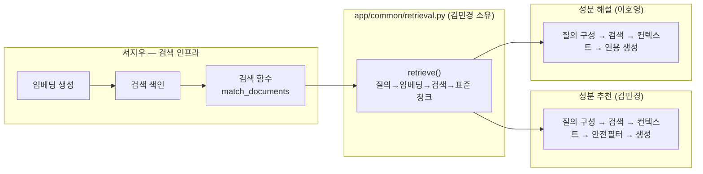
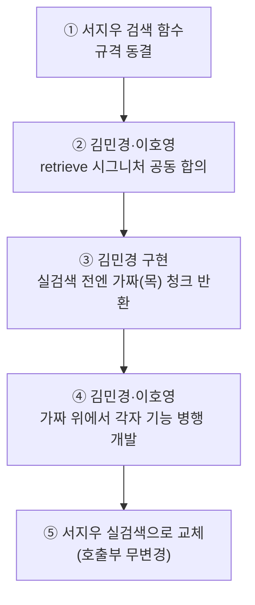

# 공유 검색 유틸(retrieve) 설계서

- **작성일**: 2026-07-10
- **작성자**: 김민경
- **위치**: `app/common/retrieval.py` (소유: 김민경)
- **공동 사용자**: 김민경(성분 추천) · 이호영(성분 해설·주의사항)

RAG 기능 두 개 — 성분 추천([01-recommendations-pipeline.md](01-recommendations-pipeline.md))과 성분 해설(`ingredient_detail`) — 이 함께 쓰는 자료 검색 함수 `retrieve()`의 계약을 정의한다. 검색 인프라(임베딩·색인·검색 함수)는 서지우 소유이고, 이 문서는 그 위에 얹는 **공용 호출 계약**을 다룬다.

## 0. 한눈에 보기

- **왜 공유하나**: 추천도 해설도 "질의 → 의미 검색 → 근거 문서"라는 같은 뼈대를 쓴다. 각자 검색 코드를 따로 짜면 임베딩 모델·점수 정규화·오류 처리가 제각각이 되어 두 기능의 품질이 어긋난다. 검색 부분만 하나의 함수로 묶는다.
- **어디까지가 공유인가**: `retrieve()`는 **자료를 찾아오는 데까지만** 한다. 무엇을 검색어로 쓸지, 찾아온 자료로 무엇을 생성할지는 각 기능(추천=김민경, 해설=이호영)이 통째로 소유한다. 이 경계를 넘으면 매 단계마다 협의 지점이 생겨 되레 느려진다.
- **누가 무엇을**: 서지우 = 임베딩·색인·검색 함수(인프라) / 김민경 = `retrieve()` 껍데기 소유·신설 / 김민경·이호영 = 껍데기 위에서 각자 기능 개발.
- **핵심 원칙 3가지 (반드시 못 박음)**: 점수는 0~1로 통일 · 점수 낮은 자료 버리기는 부르는 쪽이 각자 판단 · 결과 없으면 오류가 아니라 빈 목록.

## 1. 소유권·경계



- **공유(수평)**: `retrieve()` 함수 하나. 검색 파라미터(어떤 컬렉션·필터·개수)는 부르는 쪽이 정한다.
- **기능별(수직)**: 검색어 만들기 → 컨텍스트 구성 → 생성까지는 각 기능 오너가 통째로 소유. RAG의 검색↔생성은 강하게 얽혀 있어 한 사람이 묶어야 매끄럽기 때문이다.
- **RAG 아님**: 개별 성분 기본 조회(`ingredient_search`, 박영기)는 단순 DB 조회라 이 유틸을 쓰지 않는다.

## 2. 함수 계약

계약이라 시그니처·반환 형태를 코드로 고정한다.

```python
# app/common/retrieval.py
async def retrieve(
    collection: RetrievalCollection,
    query: str,
    filters: dict | None = None,
    top_k: int = 5,
) -> list[RetrievedChunk]:
    """질의로 벡터 컬렉션을 검색해 표준 청크 목록을 반환한다.
    검색까지만 한다 — 생성·프롬프트·저score 컷은 호출자 몫."""
```

```python
# app/common/schemas.py
class ChunkSource(BaseModel):
    doc_id: str
    title: str
    locator: str | None = None   # 예: 식약처 원료 ID, PMID

class RetrievedChunk(BaseModel):
    content: str                 # 프롬프트에 넣을 근거 텍스트
    score: float                 # 0~1 정규화 (아래 §4-A)
    source: ChunkSource          # 출처 (구조화 — 문자열 아님)
    metadata: dict               # 기능별 필요 키 (호출자가 소비)
```

- **동작**: 질의 → Gemini 임베딩 → 서지우의 검색 함수 호출 → 표준 청크로 변환해 반환.
- `metadata`에 담기는 키는 컬렉션마다 다르다 (추천은 성분 ID·주의사항 등, 해설은 해설 기능이 요구하는 키). 무엇을 담을지는 서지우 검색 함수 규격에 반영한다.

## 3. 컬렉션 정의

`RetrievalCollection`은 문자열 오타를 막기 위해 Enum으로 고정한다.

| 컬렉션 | 소유 | 내용 | 쓰는 기능 |
|---|---|---|---|
| `rec_cases` | 김민경 | 상담 사례 8,000건 | 성분 추천 |
| `rec_efficacy` | 김민경 | 성분 효능 지식 2,465종 | 성분 추천 |
| `mfds_ingredient` | 서지우 인덱싱 | 식약처 원료 정보(해설용) | 성분 해설 (이호영) |

> 추천 2종은 [02-recommendations-data-spec.md](02-recommendations-data-spec.md)에서 정의. 해설용 `mfds_ingredient`의 원본·임베딩 대상·metadata 키는 **이호영이 정의**하고 서지우 인덱싱과 합의한다 (이 문서 범위 밖 — §6 확인 항목).

## 4. 합의 필수 항목 + 오류 처리

두 기능이 같은 함수를 다르게 해석하면 조용히 어긋난다. 아래를 못 박는다.

| # | 항목 | 합의 내용 |
|---|---|---|
| A | 점수 척도 | score는 **0~1 정규화**(코사인 유사도 기준). 이호영의 "확인 불가" 임계값도 이 척도를 전제로 잡는다 |
| B | 저score 컷 | 유틸은 점수 낮은 자료를 **버리지 않는다**. 자를 기준은 부르는 쪽이 각자 판단(추천은 0.5, 해설은 이호영이 정함) |
| C | 빈 결과 | 결과가 없으면 **예외가 아니라 빈 목록** 반환. 근거 없음 판단은 호출자가 함 |
| D | 오류 처리 | 검색 인프라 오류(임베딩·검색 함수 실패)는 **공통 예외 클래스 1개**(`RetrievalError`)로 감싸 던진다. 호출자는 이 예외만 잡으면 됨 |
| E | 임베딩 계약 | 임베딩 모델·차원(1536)을 유틸에 고정 — 두 기능이 같은 좌표계를 쓰도록 (서지우 §4 요청 명세와 동일) |

## 5. 가짜 → 실구현 교체 계획 (contract-first)

계약을 먼저 얼리고 양쪽이 병행 개발한다. 서지우 인프라가 늦어도 두 기능이 막히지 않는다.



가짜 버전은 컬렉션별로 고정 청크를 돌려주므로, 추천·해설 둘 다 실제 검색 준비 전에 처음부터 끝까지 만들고 시연할 수 있다. ⑤에서 유틸 내부만 실검색으로 바꾸면 두 기능의 호출 코드는 그대로다.

## 6. 협의·확인 항목

| 항목 | 상대 | 내용 |
|---|---|---|
| 시그니처 공동 합의 | 이호영 | §2 함수 계약·§4 합의 항목(특히 점수 척도·오류 클래스)을 함께 확정 |
| 해설 컬렉션 정의 | 이호영·서지우 | `mfds_ingredient`의 원본·임베딩 대상 텍스트·metadata 필수 키를 이호영이 정의, 서지우 인덱싱과 합의 |
| 해설 metadata 키 | 이호영 | 해설·주의사항 생성에 필요한 키(성분명·주의사항·출처 등)를 §2 `metadata`에 요구 |
| 검색 함수·임베딩 | 서지우 | 02 문서 §4 요청 명세 (검색 함수 규격·metadata·임베딩 차원 — 추천·해설 공용) |

## 구성 근거

- 계층을 "검색 공유 / 검색어~생성 기능별"로 나눈 것은 RAG의 검색↔생성이 강결합이기 때문. 파이프라인을 단계별로 수평 분담하면 매 경계마다 협의 지점이 생긴다. 검색이라는 얇은 층만 공유하고 나머지는 기능 오너가 통째로 갖는다.
- 계약을 코드(시그니처·스키마)로 고정한 것은 두 사람이 병행 개발하기 때문. 말이 아니라 타입으로 못 박아야 어긋나지 않는다.
- 가짜 버전을 먼저 두는 contract-first는 서지우 인프라와의 직렬 의존을 끊어 일정 리스크를 낮춘다.
