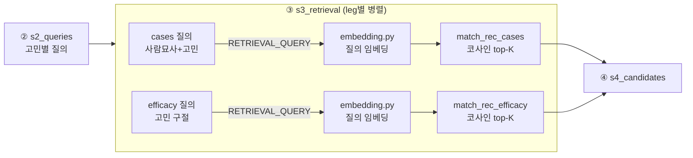

# ③ 벡터 검색 실구현 설계서

- **작성일**: 2026-07-23
- **작성자**: 김민경
- **대상 모듈**: `app/modules/recommendations/pipeline/s3_retrieval.py` 외 · 엔드포인트: `POST /api/v1/recommendations`
- **관계**: [01-recommendations-pipeline.md](01-recommendations-pipeline.md) §2-③의 "키워드 대체 검색"을 실제 벡터 검색으로 교체. 데이터·임베딩 명세는 [02-recommendations-data-spec.md](02-recommendations-data-spec.md).

## 0. 배경

01 설계의 ③ Retrieval은 벡터 인덱스·검색 RPC가 없어 **키워드 대체(ILIKE·배열 겹침) 모드**로 동작해 왔다. "id 작은 순 limit"이라 관련성이 아니라 결정성만 보장했다(주름 검색에 레티놀·아데노신이 안 잡힘). 임베딩 모델이 확정되고 DB에 실제 임베딩이 적재되면서 이 상한을 걷어낸다.

**확정 사항 (2026-07-23)**

- 임베딩 담당이 서지우 → **김민경**으로 이관. 03 이후 벡터 검색은 추천 모듈 소유.
- 임베딩 모델 **확정**: 모델 비교(`tests/modules/recommendations/embedding/`) 결과 아래로 고정.

| 항목 | 값 | 근거 |
|---|---|---|
| 모델 | `gemini-embedding-001` (Vertex 경유) | 모델 비교 스크립트 확정 |
| 차원 | 1536 | DB `vector(1536)` 컬럼·HNSW 인덱스와 결합 |
| 정규화 | L2 | 코사인 유사도 = 정규화 벡터 내적 |
| task_type | 코퍼스 `RETRIEVAL_DOCUMENT` · 질의 `RETRIEVAL_QUERY` | 비대칭 검색 규칙 |
| 유사도 | 코사인 (`vector_cosine_ops` HNSW) | `1 - (embedding <=> query)` |

**현재 DB 상태 (2026-07-23 확인)**: `rec_cases` 8,000/8,000 · `rec_efficacy` 2,270/2,270 임베딩 채워짐(1536차원). HNSW 인덱스 `rec_cases_embedding_hnsw`·`rec_efficacy_embedding_hnsw` 존재. **검색 RPC 함수만 미생성.**

## 1. 변경 범위

| 파일 | 종류 | 내용 |
|---|---|---|
| `app/core/config.py` | 수정 | `embedding_model`·`embedding_dimensions` env 필드 추가 |
| `app/modules/recommendations/embedding.py` | **신규** | 질의 임베딩 유틸 (gemini-embedding-001, async) |
| `supabase/migrations/015_add_rec_search_rpc.sql` | **신규** | `match_rec_cases`·`match_rec_efficacy` RPC |
| `pipeline/s3_retrieval.py` | 수정 | 키워드 검색 → 순수 벡터 검색으로 교체 |
| `constants.py` | 수정 | `RETRIEVAL_MODE` 삭제, `MIN_RETRIEVAL_SCORE` 재튜닝 |
| `scripts/backfill_rec_embeddings.py` | 수정 | 신규 임베더 재사용 (코퍼스·질의 단일 소스화) |
| `tests/modules/recommendations/test_retrieval.py` | 수정 | ILIKE 가정 → RPC 목킹으로 재작성 |

`s4`~`s8`·응답 스키마·`s8_products`(제품 추천)는 **무변경** — s3 내부만 바뀌고 청크 계약(`RetrievedChunk`)은 유지되므로, 성분 추천 + 제품 추천이 한 응답에 담기는 흐름은 영향받지 않는다.

## 2. 질의 임베딩 유틸 (`embedding.py`)

- `get_gemini()`(Vertex 클라이언트) 재사용, `client.aio.models.embed_content`로 **async** 호출. s3가 비동기라 동기 임베더를 스레드로 감싸지 않는다.
- 모델명·차원은 `get_settings()`에서 읽는다. 정규화(L2)·질의 task_type(`RETRIEVAL_QUERY`)은 코드 고정(값이 아니라 검색 규칙이므로 env 아님).
- **단일 소스**: 이 모듈이 임베딩 규칙(모델·차원·정규화·task_type 매핑)의 유일한 정의처다. `backfill_rec_embeddings.py`(코퍼스=DOCUMENT)도 이 임베더를 재사용해, env를 바꿨을 때 코퍼스와 질의가 다른 모델로 임베딩되는 조용한 drift를 원천 차단한다.
- **위치**: 추천 전용이라 모듈 안에 둔다. 성분 검색(영기 모듈)이 나중에 벡터를 쓰면 그때 `app/core`로 승격 — 실사용 전 선제 공유 안 함.

### config env 필드

| 필드 | 기본값 | 주의 |
|---|---|---|
| `embedding_model` | `gemini-embedding-001` | 코퍼스와 반드시 동일 |
| `embedding_dimensions` | `1536` | **자유값 아님** — DB `vector(1536)` 컬럼·HNSW와 결합. 바꾸면 컬럼 재정의 + 전체 재임베딩(10,270행) 필요. 이 제약을 필드 주석에 명기. |

## 3. 검색 RPC (`015_add_rec_search_rpc.sql`)

두 leg를 각각의 함수로 노출한다. PostgREST에서 `<=>` 벡터 연산·HNSW 정렬을 직접 못 하므로 DB 함수가 필요하다.

| 함수 | 인자 | 반환 | 정렬 |
|---|---|---|---|
| `match_rec_cases` | `query_embedding vector(1536)`, `match_count int` | `_search_cases`가 뽑던 컬럼 + `score` | `embedding <=> query_embedding` 오름차순 (유사도 내림차순), `limit match_count` |
| `match_rec_efficacy` | 〃 | `_search_efficacy` 컬럼 + `score` | 〃 |

- `score = 1 - (embedding <=> query_embedding)` (코사인 유사도, 0~1). L2 정규화된 벡터라 코사인 거리 `<=>`가 곧 유사도의 여집합.
- 함수 안에서 HNSW 인덱스가 타도록 `order by embedding <=> query_embedding` 형태 유지(정렬식을 함수로 감싸면 인덱스를 못 탄다).

## 4. s3_retrieval 교체

**삭제**: `_search_cases`·`_search_efficacy`·`_rank_score`·`_FAKE_TOP_SCORE`/`_FAKE_SCORE_STEP`/`_FAKE_MIN_SCORE`·`_FALLBACK_SCORE`·무필터 fallback 분기.

**교체**: `retrieve()`는 질의 텍스트를 임베딩(§2) → `client.rpc("match_rec_*", {"query_embedding": ..., "match_count": top_k})` → 반환 행을 기존 `_case_chunk`/`_efficacy_chunk`로 매핑. score는 RPC가 준 실제 코사인 값.

### leg별 질의 텍스트 (노션 다이어그램 반영)

| leg | 질의 텍스트 | 출처 |
|---|---|---|
| cases | `"30대 여성 지성·민감 경향 피부의 모공 관리에 도움되는 성분"` (사람묘사+고민) | s2 `build_queries` 현행 그대로 |
| efficacy | `"모공 피지"` (짧은 고민 구절) | `" ".join(CONCERN_SEARCH_KEYWORDS[code])` |

efficacy 코퍼스는 `name_kr + efficacy + product_traits`(효능 설명)라 인구통계가 붙은 긴 질의보다 효능 중심 짧은 구절이 매칭이 맞다. `_retrieve_one`에서 leg별로 다른 질의를 임베딩한다.

## 5. 임계값 재튜닝

키워드 모드의 가짜 score(0.55~0.9)와 실제 코사인 분포는 다르다. `MIN_RETRIEVAL_SCORE`는 초기값을 두고 Langfuse 트레이스의 실제 score 분포로 조정한다. `_above_threshold` 컷 위치·호출자 판단 구조는 유지.

## 6. 흐름

## 7. 미결정·리스크

- **임계값 초기값**: 코사인 분포 확인 전까지 잠정. 실데이터 QA로 확정.
- **질의 임베딩 지연**: 고민 N개 × 2 leg = 2N회 임베딩 호출이 추가된다. `retrieve_for_concerns`의 `asyncio.gather` 병렬은 유지되나, Vertex 임베딩 API 레이턴시가 전체 응답 시간에 더해진다. 필요 시 동일 고민 구절 임베딩 캐시(구절은 고정 8종)로 완화 — v1은 미도입(YAGNI), 트레이스로 실측 후 판단.
- **backfill drift**: §2의 단일 소스화로 차단하되, 이미 적재된 DB는 재실행하지 않는다(멱등 스킵). env 변경 시에만 `--force` 재적재.
