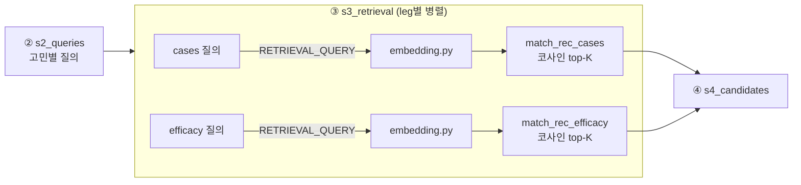

# ③ 벡터 검색 설계서

- **작성일**: 2026-07-23
- **최종 수정**: 2026-07-23 (구현 완료 반영 — RPC 생성·파일명 정정)
- **작성자**: 김민경
- **대상**: `app/modules/recommendations/pipeline/s3_retrieval.py` · `embedding.py` · `supabase/migrations/015`
- **관계**: [01](01-recommendations-pipeline.md) §3-③의 실구현. 데이터·임베딩 명세는 [02](02-recommendations-data-spec.md).

## 0. 배경·확정 사항

③은 벡터 인덱스·검색 RPC가 없어 키워드 대체(ILIKE·배열 겹침) 모드로 동작해 왔다. "id 작은 순
limit"이라 관련성이 아니라 결정성만 보장했다(주름 검색에 레티놀·아데노신이 안 잡힘).
임베딩 적재와 RPC 생성으로 이 상한을 걷어냈다.

- 임베딩 담당이 서지우 → **김민경**으로 이관. 벡터 검색은 추천 모듈 소유(02 §4의 서지우 요청
  명세는 이 이관으로 종료).
- **DB 상태**: `rec_cases` 8,000/8,000 · `rec_efficacy` 2,270/2,270 임베딩 적재 완료.
  HNSW 인덱스(`014`)·검색 RPC(`015`) 생성 완료.

| 항목 | 값 | 근거 |
|---|---|---|
| 모델 | `gemini-embedding-001` (Vertex 경유) | 모델 비교(`tests/modules/recommendations/embedding/`) 결과 |
| 차원 | 1536 | DB `vector(1536)` 컬럼·HNSW와 결합 |
| 정규화 | L2 | 코사인 유사도 = 정규화 벡터 내적 |
| task_type | 코퍼스 `RETRIEVAL_DOCUMENT` · 질의 `RETRIEVAL_QUERY` | 비대칭 검색 규칙 |
| 유사도 | 코사인 (`vector_cosine_ops`) | `1 - (embedding <=> query)` |

## 1. 구성

| 파일 | 역할 |
|---|---|
| `app/core/config.py` | `embedding_model`·`embedding_dimensions` env 필드 |
| `app/modules/recommendations/embedding.py` | 질의 임베딩 유틸 (async) |
| `supabase/migrations/015_add_rec_search_rpc.sql` | `match_rec_cases`·`match_rec_efficacy` |
| `pipeline/s3_retrieval.py` | 임베딩 → RPC → `RetrievedChunk` 매핑 |
| `scripts/backfill_rec_embeddings.py` | 코퍼스 임베딩 적재 (같은 임베더 재사용) |

`s4` 이후·응답 스키마·`s9_products`는 **무변경** — s3 내부만 바뀌고 청크 계약(`RetrievedChunk`)이
유지되므로 성분 추천 + 제품 추천 흐름은 영향받지 않는다.

## 2. 질의 임베딩 (`embedding.py`)

- `get_gemini()`(Vertex 클라이언트) 재사용, `client.aio.models.embed_content`로 **async** 호출.
  s3가 비동기라 동기 임베더를 스레드로 감싸지 않는다.
- 모델명·차원은 `get_settings()`에서 읽는다. 정규화(L2)·질의 task_type은 코드 고정 —
  값이 아니라 검색 규칙이라 env가 아니다.
- **단일 소스**: 임베딩 규칙(모델·차원·정규화·task_type)의 유일한 정의처다.
  `backfill_rec_embeddings.py`(코퍼스=DOCUMENT)도 이 임베더를 재사용해, env를 바꿨을 때
  코퍼스와 질의가 다른 모델로 임베딩되는 조용한 drift를 원천 차단한다.
- **위치**: 추천 전용이라 모듈 안에 둔다. 성분 검색(박영기 모듈)이 나중에 벡터를 쓰면 그때
  `app/core`로 승격 — 실사용 전 선제 공유 안 함.

| env 필드 | 기본값 | 주의 |
|---|---|---|
| `embedding_model` | `gemini-embedding-001` | 코퍼스와 반드시 동일 |
| `embedding_dimensions` | `1536` | **자유값 아님** — DB 컬럼·HNSW와 결합. 바꾸면 컬럼 재정의 + 전체 재임베딩(10,270행) |

## 3. 검색 RPC

PostgREST에서 `<=>` 벡터 연산·HNSW 정렬을 직접 못 하므로 leg마다 DB 함수로 노출한다.

| 함수 | 인자 | 반환 | 정렬 |
|---|---|---|---|
| `match_rec_cases` | `query_embedding vector(1536)`, `match_count int` | 케이스 컬럼 + `score` | `embedding <=> query_embedding` 오름차순, `limit match_count` |
| `match_rec_efficacy` | 〃 | `EFFICACY_FIELDS` + `score` | 〃 |

- `score = 1 - (embedding <=> query_embedding)` (코사인 유사도 0~1). L2 정규화된 벡터라 코사인
  거리가 곧 유사도의 여집합이다.
- 정렬식을 함수로 감싸면 HNSW 인덱스를 못 타므로 `order by embedding <=> query_embedding`
  형태를 유지한다.

## 4. leg별 질의 텍스트

| leg | 질의 | 출처 |
|---|---|---|
| cases | `"붉어짐 고민, 30대 여성 건성·민감 경향 피부"` (고민 중심 + 사람묘사) | `s2.build_queries` (04 §2-1a로 고민 중심 재배치) |
| efficacy | `"홍조 진정"` (짧은 고민 구절) | `CONCERN_SEARCH_KEYWORDS[code]` |

efficacy 코퍼스는 `name_kor + efficacy + product_traits`라 인구통계가 붙은 긴 질의보다 효능
중심 짧은 구절이 매칭이 맞다. `_retrieve_one`이 leg별로 다른 질의를 임베딩한다.

## 5. 흐름

## 6. 미결정·리스크

- **임계값**: `MIN_RETRIEVAL_SCORE = 0.5`는 잠정치다. 키워드 모드의 가짜 score(0.55~0.9)와
  실제 코사인 분포는 다르므로 Langfuse 트레이스의 실측 분포로 재조정한다.
- **질의 임베딩 지연**: 고민 N개 × 2 leg = 2N회 호출이 추가된다. `asyncio.gather` 병렬은
  유지되나 Vertex 임베딩 레이턴시가 응답 시간에 더해진다. 필요 시 고민 구절 임베딩 캐시
  (구절은 고정 8종)로 완화 — v1 미도입, 트레이스 실측 후 판단.
- **backfill drift**: §2의 단일 소스화로 차단하되 이미 적재된 DB는 재실행하지 않는다
  (멱등 스킵). env 변경 시에만 `--force` 재적재.
- **동점 tie-break 부재**: RPC 정렬이 거리 하나뿐이라 동점 행이 `limit` 경계에 걸리면 회수
  집합이 실행마다 달라진다 — 04 §9의 남은 변동 요인.
