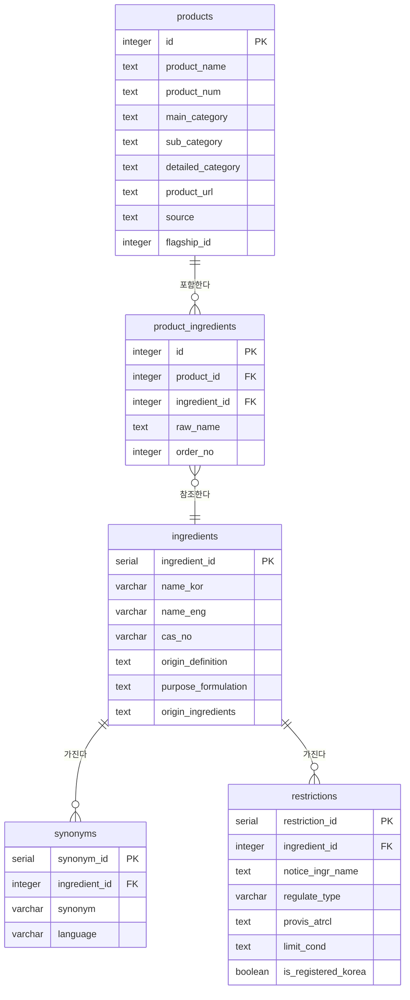

# 데이터베이스 스키마 문서

코스메틱 제품/성분 크롤링 데이터의 테이블 구조를 정리한 문서입니다.

## ERD

## 테이블 목록

| 테이블 | 설명 |
|---|---|
| `products` | 크롤링한 제품 기본 정보 |
| `product_ingredients` | 제품-성분 매핑 (제품별 성분 기재 순서 포함) |
| `ingredients` | 성분 기본 정보 (표준명, CAS 번호, 기원 등) |
| `synonyms` | 성분 이명(동의어) 사전 |
| `restrictions` | 국내 화장품 원료 사용 제한/금지 정보 |

## 테이블 상세

### products

테이블은 대분류에 맞게 나누지 않는다. 다만, `id`는 아래 원칙을 따른다.

- 스킨케어: 10000번대
- 마스크팩: 20000번대
- 클렌징: 30000번대
- 선케어: 40000번대

| 컬럼 | 타입 | 설명 |
|---|---|---|
| id | INTEGER PK | 구분용 PK (위 번호대 규칙 적용) |
| product_name | TEXT NOT NULL | 제품명 |
| product_num | TEXT | 제품번호 |
| brand | TEXT | 브랜드 |
| main_category | TEXT | 대분류 |
| sub_category | TEXT | 중분류 |
| detailed_category | TEXT | 소분류 |
| product_url | TEXT | 제품 링크 (올리브영) |
| source | TEXT | 데이터 출처 |
| flagship_id | INTEGER | 대표 제품번호 (동일 제품 그룹의 대표 지정용) |

### product_ingredients

| 컬럼 | 타입 | 설명 |
|---|---|---|
| id | INTEGER PK | 구분용 PK |
| product_id | INTEGER FK | `products.id` 참조 |
| ingredient_id | INTEGER FK | `ingredients.ingredient_id` 참조 |
| raw_name | TEXT | 성분명 — 매칭용, 데이터 적재 후 삭제 예정 컬럼 |
| order_no | INTEGER | 제품 성분 기재 순서 |

### ingredients (성분 정보 기본 테이블)

| 컬럼 | 타입 | 설명 |
|---|---|---|
| ingredient_id | SERIAL PK | 구분 PK |
| name_kor | VARCHAR | 표준 한글명 |
| name_eng | VARCHAR | 표준 영문명 |
| cas_no | VARCHAR | CAS 번호 |
| origin_definition | TEXT | 기원 및 정의 |
| purpose_formulation | TEXT | 배합 목적 |
| origin_ingredients | TEXT | 성분의 기원 |

### synonyms (이명 사전 테이블)

| 컬럼 | 타입 | 설명 |
|---|---|---|
| synonym_id | SERIAL PK | 구분 PK |
| ingredient_id | INTEGER FK | 외래키 (`ingredients.ingredient_id` 참조) |
| synonym | VARCHAR | 구명칭/동의어 |
| language | VARCHAR | kor/eng |

### restrictions

| 컬럼 | 타입 | 설명 |
|---|---|---|
| restriction_id | SERIAL PK | 구분 PK |
| ingredient_id | INTEGER FK, NULL 허용 | 한국 화장품 원료 사전에 등재되지 않은 물질 존재 가능 |
| notice_ingr_name | TEXT | 고시원료명 — 식약처 고시 문서(법령)에 실제 표기된 명칭 |
| regulate_type | VARCHAR | 금지/한도(제한) |
| provis_atrcl | TEXT | 특정 상황에 한해서 제약이 있을 경우 |
| limit_cond | TEXT | 한도일 경우 세부 내용 |
| is_registered_korea | BOOLEAN | 한국 화장품 원료 사전 등재 여부 (`ingredients`에 없는 원료도 존재) |

## 관계

- `products.id` (1) — `product_ingredients.product_id` (N)
- `ingredients.ingredient_id` (1) — `product_ingredients.ingredient_id` (N)
- `ingredients.ingredient_id` (1) — `synonyms.ingredient_id` (N)
- `ingredients.ingredient_id` (1) — `restrictions.ingredient_id` (N, nullable)

## 데이터 수집 & 정제 기준

### 1. 수집 데이터 컬럼
대분류, 중분류, 소분류, 브랜드, 제품명, 제품번호, 링크, 성분

### 2. 데이터 정제 후 컬럼
대분류, 중분류, 소분류, 브랜드, 제품명, 정제된 제품명, 제품번호, 링크, 성분, 대표상품번호, 데이터출처

### 정제 규칙
- 브랜드와 성분이 **완전히 동일한 제품**은 같은 `대표상품번호`(`flagship_id`)를 부여한다.
- `데이터출처`는 현재 **올리브영**으로 저장한다.
- 정제 완료 후 **브랜드 → 정제된 제품명** 순으로 정렬한다.

## 데이터 적재 기준

### 4.1 동일 제품이 여러 제품번호로 등록된 경우
- 모두 데이터에 적재한다.
- 대표상품번호는 동일하게 저장한다.
- 브랜드, 성분으로 동일 제품인지 구분한다.
- 중복 제품은 별도의 관리 테이블에서 관리한다.

### 4.2 하나의 제품 안에 여러 종류가 있는 경우
예시: `product_id_종류`

- 대표상품번호는 종류에 따른 구분 없이 `flagship_id`를 사용한다.
- `product_id_종류`에서 종류에는 성분표에 기재된 종류명을 사용한다.

### 4.3 원래는 여러 종류의 제품이지만 일부만 별도 등록된 경우
예시: 6종 제품 중 2종만 별도 등록

- 대표상품번호만 올바르게 연결되어 있으면 된다.
- 단, 성분이 다르기 때문에 동일 제품인지 구분하기 어려울 수 있음 → 판별 기준 추가 논의 필요

### 4.4 성분 정보가 없는 경우
- 데이터를 적재하지 않는다.

### 4.5 1제 / 2제로 구성된 제품
- 별도의 구분 없이 `order_no`를 부여한다 (하나의 성분 리스트로 이어서 처리).