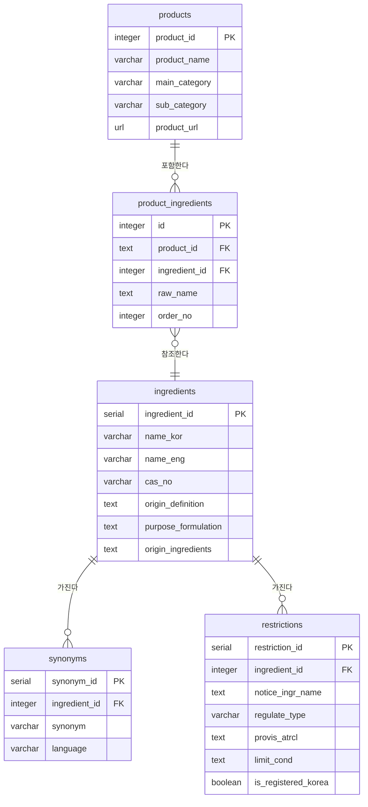

# 데이터베이스 스키마 문서

코스메틱 제품/성분 크롤링 데이터의 테이블 구조를 정리한 문서입니다.

## ERD

## 테이블 목록

| 테이블 | 설명 |
|---|---|
| `products` | 크롤링한 제품 기본 정보 |
| `product_ingredients` | 제품-성분 매핑 (제품별 성분 기재 순서 포함) |
| `ingredients` | 성분 기본 정보 (표준명, CAS 번호, 기원 등) |
| `synonyms` | 성분 이명(동의어) 사전 |
| `restrictions` | 국내 화장품 원료 사용 제한/금지 정보 |

## 테이블 상세

### products

| 컬럼 | 타입 | 설명 |
|---|---|---|
| product_id | TEXT PK | 제품번호 |
| product_name | VARCHAR NOT NULL | 제품명 |
| main_category | VARCHAR | 대분류 |
| sub_category | VARCHAR | 소분류 |
| product_url | URL | 제품 링크 (올리브영) |
| product_ingredients | TEXT | 성분정보 (product_ingredients 테이블과 연결) |

### product_ingredients

| 컬럼 | 타입 | 설명 |
|---|---|---|
| id | INTEGER PK | PK용 번호 |
| product_id | TEXT FK | 제품 번호 (`products.product_id` 참조) |
| ingredient_id | INTEGER FK | 성분 번호 (`ingredients.ingredient_id` 참조) |
| raw_name | TEXT | 성분명 — 매칭용, 정리 완료 후 삭제 예정 컬럼 |
| order_no | INTEGER | 제품 성분 기재 순서 |

### ingredients (성분 정보 기본 테이블)

| 컬럼 | 타입 | 설명 |
|---|---|---|
| ingredient_id | SERIAL PK | 구분 PK |
| name_kor | VARCHAR | 표준 한글명 |
| name_eng | VARCHAR | 표준 영문명 |
| cas_no | VARCHAR | CAS 번호 |
| origin_definition | TEXT | 기원 및 정의 |
| purpose_formulation | TEXT | 배합 목적 |
| origin_ingredients | TEXT | 성분의 기원 |

### synonyms (이명 사전 테이블)

| 컬럼 | 타입 | 설명 |
|---|---|---|
| synonym_id | SERIAL PK | 구분 PK |
| ingredient_id | INTEGER FK | 외래키 (`ingredients.ingredient_id` 참조) |
| synonym | VARCHAR | 구명칭/동의어 |
| language | VARCHAR | kor/eng |

### restrictions

| 컬럼 | 타입 | 설명 |
|---|---|---|
| restriction_id | SERIAL PK | 구분 PK |
| ingredient_id | INTEGER FK, NULL 허용 | 한국 화장품 원료 사전에 등재되지 않은 물질 존재 가능 |
| notice_ingr_name | TEXT | 고시원료명 — 식약처 고시 문서(법령)에 실제 표기된 명칭 |
| regulate_type | VARCHAR | 금지/한도(제한) |
| provis_atrcl | TEXT | 특정 상황에 한해서 제약이 있을 경우 |
| limit_cond | TEXT | 한도일 경우 세부 내용 |
| is_registered_korea | BOOLEAN | 한국 화장품 원료 사전 등재 여부 (`ingredients`에 없는 원료도 존재) |

## 관계

- `products.product_id` (1) — `product_ingredients.product_id` (N)
- `ingredients.ingredient_id` (1) — `product_ingredients.ingredient_id` (N)
- `ingredients.ingredient_id` (1) — `synonyms.ingredient_id` (N)
- `ingredients.ingredient_id` (1) — `restrictions.ingredient_id` (N, nullable)
